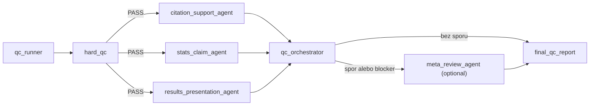

# Plan malej agentovej QC vrstvy pre diplomovku

> Posledna aktualizacia: 2026-04-17
> Ucel: navrhnut malu, auditovatelnu QC vrstvu nad `R` pipeline, `Zotero` exportom a draftingom Results.

## Kratky verdikt

Ano, zaviest sa to da a pre tuto diplomovku to dava zmysel.

Pre toto repo vsak neodporucam komplikovany multi-agent framework po vzore plneho workflowu. Lepsia verzia je:

1. deterministicky `hard_qc`,
2. tri specializovane Pydantic AI agenti,
3. jeden orchestrator s pevnou decision policy,
4. optionalny `meta_review` len vtedy, ked si agenti odporuju alebo ked treba potvrdit blocker.

Najdolezitejsie pravidlo je toto: **LLM nema byt zdroj pravdy pre vypocty**. Zdroj pravdy ostava:

- `analysis/scripts/thesis_rating_pipeline.R`,
- `analysis/outputs/*.csv`,
- `tables/*.csv`,
- `figures/`,
- `references/zotero-thesis.bib`,
- `notes/literature/*.md`.

LLM vrstva ma robit audit, interpretacnu kontrolu a report findings, nie nahradzat statistiku alebo Zotero.

## Co si zobrat z `ai-patient-sim`

Zo sesterskeho repa sa oplati prebrat hlavne tieto principy:

- workflow actors, nie volny swarm,
- `hard_qc` pred kazdym LLM passom,
- typed vystupy cez Pydantic modely,
- jeden orchestrator miesto retaze autonomnych agentov,
- audit trail a finalny report ako artefakt behu.

Pre tuto diplomovku naopak netreba preniest:

- optimizer/regeneration loop,
- comparator medzi viacerymi kandidatmi,
- zbytocne hlboku observability/UI vrstvu,
- samostatny backend pre plny agent platform runtime.

## Ciele QC vrstvy

- zablokovat broken citekeys, manualne author-year citacie a rozbite vazby na Zotero export,
- odhalit nekonzistencie medzi `analysis/data_clean/`, `analysis/outputs/`, `tables/`, `figures/` a `manuscript/40_results.md`,
- skontrolovat, ci text o vysledkoch sedi so smerom efektu, `p`-hodnotou, intervalom spolahlivosti a `status` flagmi v outputoch,
- skontrolovat, ci Results nepretazuju text, nezdvojuju tabulky a neprezentuju `skipped` alebo exploracne vetvy ako konfirmacne jadro,
- vytvorit jeden konsolidovany QC report s prioritizovanymi findingmi.

## Non-goals

- neprepisovat core statistiku z `R` do `Python`,
- nechat LLM "dovymyslat" chybajuce cisla alebo interpretacie,
- robit automaticke rewrite-y `manuscript/40_results.md` bez explicitneho schvalenia,
- menit Zotero metadata alebo `.bib` export automaticky pri QC passe,
- stavat dalsiu nadradenu vrstvu LLM nad orchestratorom pri kazdom behu.

## Navrhovana architektura



Prakticky to ma byt stale sekvencny alebo mierne paralelny workflow, nie autonomny multi-agent system.

## Vrstva 1: deterministicky `hard_qc`

Tato vrstva ma mat vacsiu dolezitost nez samotne LLM review. Ked hard checks failnu, orchestrator ma bezat do `BLOCK` alebo `REVISE` bez toho, aby sa LLM snazil chybu "zachranit".

| Modul | Vstupy | Co ma kontrolovat | Kedy je to blocker |
| --- | --- | --- | --- |
| `data_integrity_qc` | `analysis/data_clean/*.csv`, `analysis/outputs/run_manifest.csv` | duplikaty, broken joins, validne skaly, pocty riadkov, `source_mode`, match medzi `ratings`, `transcripts`, `seeds`, `raters` | chybajuci clean subor, duplikat `rater_id + transcript_id`, broken join, nevalidna skala, `source_mode != data_clean` pri finalnom rune |
| `artifact_projection_qc` | `analysis/outputs/*.csv`, `tables/*.csv`, `figures/*` | ci manuscript-ready tabulky a grafy naozaj sedia s autoritativnymi outputmi | chyba povinny output, `table_5_icc.csv` nesedi s `icc_summary.csv`, `table_6_mixed_models_core.csv` nesedi s `lmm_core_models.csv` alebo `clmm_item_models.csv` |
| `citation_registry_qc` | `manuscript/*.md`, `references/zotero-thesis.bib` | validita `[@citekey]`, chybajuce citekeys, manualne `(Author, Year)` formy, obvious broken placeholders | citekey chyby, citacia mimo `.bib`, rucne finalne citacie v meniacom sa drafte |
| `manuscript_state_qc` | `manuscript/40_results.md`, `docs/vo_h_model_results_map.md`, `analysis/pipeline_outputs_plan.md` | `[doplniť]` placeholdery, poradie H/VO vetiev, tvrdenia k neexistujucim outputom, reporting `skipped` stavov | finalny results mode s placeholdermi, text tvrdi inferencny vysledok k outcome-u, ktory ma `status = skipped` |
| `preview_layer_qc` | `manuscript/40_results_preview_current_export.md`, `manuscript/50_discussion_preview_current_export.md`, `tables/current_export_preview/*.md` | lokalne path leaks, workflow/meta jazyk (`preview`, `pipeline`, `clean run`), unit-of-analysis drift medzi 166 ratingmi a 72 transcript-level anchor summary | Word-ready preview obsahuje interny workflow jazyk alebo miesa transcript-level vetvu s rating-level reportovanim |

### Konkretne deterministic cross-checky pre vypocty

Toto je jadro celej QC vrstvy. Ak chces mat istotu pri vypoctoch, najvacsi signal neprinesie dalsi LLM, ale nezavisle cross-checky nad artefaktmi:

- prepocitat `table_1_dataset_summary.csv` priamo z `ratings_clean.csv` a `transcripts_master.csv`,
- prepocitat `table_2_descriptives.csv` z `analysis/outputs/analysis_long.csv`,
- overit, ze `A1-A9` a anchor fidelity vetva (`symptom_error_mean`, `severity_error`, `impact_error`) su v outputoch explicitne oznacene a reportovane ako transcript-level summary,
- overit, ze `analysis/outputs/transcript_level_summary.csv` ma presne 1 riadok na `transcript_id` a korektne `n_ratings`,
- overit, ze `table_4_internal_consistency.csv` je konzistentna projekcia z `analysis/outputs/internal_consistency.csv`,
- overit, ze `table_5_icc.csv` je konzistentna projekcia z `analysis/outputs/icc_summary.csv`,
- overit, ze `table_6_mixed_models_core.csv` je konzistentna projekcia z `analysis/outputs/lmm_core_models.csv` a `analysis/outputs/clmm_item_models.csv`,
- overit, ze preview manuscript a fragment vrstva neobsahuje lokalne filesystem cesty ani interny workflow/meta jazyk,
- overit, ze ak ma nejaky outcome v autoritativnom outpute `status = skipped`, tak sa v Results neprezentuje ako realne odhadnuty vysledok.

Pri tychto checkoch netreba LLM. To ma byt cisty kod s toleranciami a jasnym `PASS/FAIL`.

## Vrstva 2: specializovani Pydantic AI agenti

LLM agenti maju byt uzko zamerani. Kazdy dostane obmedzeny kontext a vrati typed findingy.

| Agent | Vstup | Co ma rozhodovat | Co robit nesmie |
| --- | --- | --- | --- |
| `citation_support_agent` | odsek rukopisu, citekeys v odseku, prislusne `notes/literature/*.md`, metadata z `.bib` | ci je tvrdenie oprete o uvedene zdroje, ci nie je citation drift alebo overreach | nevymyslat nove zdroje, nemenit citekeys, nespoliehat sa na "pamat" bez lokalneho zdroja |
| `stats_claim_agent` | podsekcia `40_results.md`, relevantne riadky z `analysis/outputs/*.csv` a `tables/*.csv` | ci text sedi so smerom efektu, `p`-hodnotou, CI, `status`, model family a planned contrasts | neprepocitavat modely z hlavy, neprehlasovat `skipped` za nevysledok len stylisticky, nesuplovat chybajuce cisla |
| `results_presentation_agent` | results text, tabulky, grafy, `docs/guides/sprievodca-zaverecnych-prac.md`, `docs/resources/thesis-writing-md/reportovanie-vysledkov.md` | ci je reportovanie prehladne, nezdvojuje tabulku, nepretazuje text, drzi IMRaD logiku a primeranu opatrnost | nemenit analyticku logiku, neprepisovat H/VO mapu, nevkladat nove analyzy |

### Optionalny `meta_review_agent`

Toto nema byt dalsi sef nad agentmi pri kazdom rune.

Odporucam ho spustat iba ked:

- `citation_support_agent` a `stats_claim_agent` daju protichodne blocker findingy k tej istej vete,
- nie je jasne, ci je problem v texe alebo v mapovani outputov,
- orchestrator potrebuje potvrdit blocker pred tym, nez zablokuje `pre_word` alebo `final_results` run.

## Orchestrator policy

Orchestrator ma byt jednoducha, kodom zapisana decision policy:

1. spusti `hard_qc`,
2. ak padne blocker, skonci `BLOCK` a vypise presne dovody,
3. ak hard checks prejdu, spusti troch specialistov,
4. normalizuje findingy do jednotneho modelu,
5. ak nastane spor, posle iba sporny subset do `meta_review_agent`,
6. zapise jeden finalny report.

Odporucane finalne stavy:

- `PASS_WITH_NOTES`
- `REVISE`
- `BLOCK`

Rozdelenie severity:

- `blocker`: broken data, broken citekey, broken output mapping, text tvrdi opak toho, co je v outpute,
- `major`: interpretacny overclaim, chyba CI alebo efekt v klucovej vete, nejasna opora citacie,
- `minor`: stylisticka redundancia, prehnane dlha veta, zbytocne opakovanie tabulky v texte,
- `info`: odporucanie bez nutnosti zmeny.

## Minimalne Pydantic kontrakty

Toto nema byt komplikovane. Staci mala sada stabilnych modelov:

```python
from pydantic import BaseModel
from typing import Literal


class Finding(BaseModel):
    area: Literal["data", "citation", "stats", "presentation"]
    severity: Literal["info", "minor", "major", "blocker"]
    file: str
    section_id: str | None = None
    claim_text: str | None = None
    evidence_refs: list[str] = []
    rationale: str
    suggested_fix: str | None = None


class AgentResult(BaseModel):
    agent_name: str
    decision: Literal["PASS", "REVISE", "BLOCK"]
    confidence: float
    summary: str
    findings: list[Finding]


class QCReport(BaseModel):
    run_mode: Literal["smoke", "pre_word", "final_results"]
    hard_qc_passed: bool
    overall_decision: Literal["PASS_WITH_NOTES", "REVISE", "BLOCK"]
    findings: list[Finding]
    next_actions: list[str]
```

## Odporucana struktura suborov

Prva implementacia moze ostat uplne mala:

- `analysis/scripts/run_thesis_qc.py`
- `analysis/scripts/qc_models.py`
- `analysis/scripts/qc_hard_checks.py`
- `analysis/scripts/qc_agents.py`
- `analysis/scripts/qc_report.py`
- `prompts/qc/citation_support.md`
- `prompts/qc/stats_claim.md`
- `prompts/qc/results_presentation.md`
- `analysis/qc_reports/`
- `tests/test_thesis_qc.py`

Ak sa ukaze, ze potrebujes viac helperov, az potom to rozbij na balik. Na prvy rez netreba novy framework ani web app.

## Run mody

| Mod | Na co sluzi | Co blokuje |
| --- | --- | --- |
| `smoke` | lokalny test nad pilotnymi alebo template artefaktmi | len broken kod a broken mapovanie |
| `pre_word` | kontrola pred `build_word_preview.sh` alebo `build_word_clean.sh` | blockers a major findings v Results/citaciach |
| `final_results` | finalny gate pred prepocitanim Results do Word milestone | vsetky blockers; pri dolezitych outcome vetvach aj majors |

Pri `final_results` mode by mal byt prisnejsi gate:

- `source_mode` musi byt `data_clean`,
- v `40_results.md` nesmu ostat `[doplniť]` sloty,
- jadrove outcome-y nesmu byt `skipped`,
- citekeys musia sediet s `references/zotero-thesis.bib`.

## Fazy implementacie

| Faza | Co dodat | Preco takto | Definition of done |
| --- | --- | --- | --- |
| 1 | deterministic `hard_qc` + report writer | najvyssi signal pre vypocty a najmensie riziko halucinacii | runner vie skontrolovat clean data, outputs, tabulky, citekeys a zapise `md` + `json` report |
| 2 | traja Pydantic AI specialisti + orchestrator | prinesie audit interpretacie a citacnej opory, nie dalsiu statistiku | typed findingy pre citacie, stats claims a presentation; finalny decision state funguje |
| 3 | optionalny `meta_review_agent` + `pre_word` gate | uz len na spresnenie sporov a finalny release workflow | sporove findingy maju resolver a Word build sa da pustit len po uspesnom QC |

## Dolezite implementacne rozhodnutia

### 1. Autoritativna vrstva ostava v `R`

Ak chces skutocne zvysit istotu vo vypoctoch, Python QC vrstva sa ma opierat o `R` artefakty, nie ich nahradzat.

### 2. Treba doplnit jeden maly "authority manifest"

Uz dnes mas `analysis/outputs/run_manifest.csv`, co je dobry zaciatok. Pre robustne QC by sa oplatilo doplnit este jeden export, napriklad:

- `analysis/outputs/qc_authority_manifest.csv`

Kazdy riadok by vedel povedat:

- `outcome`,
- `source_file`,
- `table_file`,
- `figure_file`,
- `status`,
- `n_rows`,
- `updated_at`,
- `reportable_in_main_text`.

Nie je to povinne pre fazu 1, ale dost to zjednodusi mapovanie textu na artefakty.

### 3. Ziadny auto-fix by default

Na prvom reze by orchestrator nemal sam menit `manuscript/40_results.md`.
Ma iba:

- najst problem,
- ukazat dokaz,
- navrhnut opravu,
- pripadne zablokovat finalny run.

### 4. Meta-QC ma byt v kode, nie v retazi "agent kontroluje agenta"

Ak sa pytas, ci nad nimi ma byt este niekto dalsi: ano, ale skor ako **deterministicky orchestrator s policy**, nie ako dalsi kreativny agent.

Optionalny `meta_review_agent` ma zmysel len ako tie-breaker na uzky subset sporov.

## Navrhovany prvy rez pre tento repo

Najrozumnejsi rollout je:

1. implementovat fazu 1 uz teraz nad existujucimi pilotnymi artefaktmi,
2. pripojit fazu 2 az ked budes mat ostre `analysis/outputs/*.csv` z realnych dat,
3. zapnut `final_results` gate az pri prepisovani `manuscript/40_results.md` do finalnej Word vetvy.

Tym padom dostanes dve veci:

- okamzity signal pre broken data a output mapping,
- neskor aj audit prezentacie vysledkov a citacnej opory bez zbytocne komplikovaneho frameworku.

## Odporucane backlog stories

- `S1`: doplnit deterministic QC runner pre clean data, output projections a citekey registry,
- `S2`: doplnit Pydantic modely a tri specializovane prompty,
- `S3`: pridat orchestrator, severity policy a finalny report,
- `S4`: napojit `pre_word` run pred Word preview buildy,
- `S5`: doplnit `qc_authority_manifest.csv` z `R` pipeline, ak sa ukaze, ze mapping je stale krehky.

## Kratke odporucanie na zaver

Ak ti ide hlavne o istotu pri vypoctoch a pri prezentacii Results, sprav z toho **guarded QC workflow**, nie "AI reviewer nad vsetkym".

Najvacsia hodnota bude v tejto kombinacii:

- deterministic cross-checky nad `R` artefaktmi,
- uzko zamerane typed agenti,
- jeden orchestrator,
- jeden finalny report.
