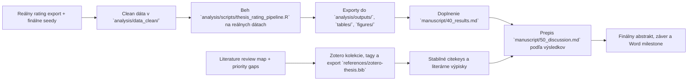

# Aktuálny stav diplomovky

> Posledná aktualizácia: 2026-04-08
> Tento súbor je operatívny dashboard. Má ukazovať reálny stav repa, nie želaný stav.

## Verdikt k dnešnému stavu

Práca nie je v počiatočnej fáze. Máš hotový výskumný rámec, revidovaný draft úvodu, prepracovanú metódu zosynchronizovanú s `H1`–`H9` a `VO1`–`VO8` z Úvodu, a placeholder kostru výsledkov rovnako zosynchronizovanú s `H1`–`H9` / `VO1`–`VO8` a s analytickým plánom v Metóde (časť 2.8), nový rozdelený literature bundle v `docs/literature/` a markdown knižnicu pomocných materiálov pre thesis writing v `docs/resources/thesis-writing-md/`. Kritická cesta je teraz jasnejšia: Zotero seed workflow je po importe a cleanup-e funkčný, `references/zotero-thesis.bib` obsahuje 114 entries vrátane 6 nových zdrojov z rozšíreného Úvodu (`who2025depression`, `chaby2022embodiedvirtualpatients`, `li2024curefun`, `wang2024patientpsi`, `lee2025adaptivevp`, `kim2025mindvoyager`), `references/bibliography-notes.md` má exact coverage a všetky citekeys v `manuscript/20_introduction.md` sa zosúladili s bibom (0 missing), core zdroje sú priradené do tematických subkolekcií, hlavná kolekcia je zosynchronizovaná so subkolekciami, thesis jadro má manuálnu vrstvu priorít a tematických tagov (mapovania pre 6 nových zdrojov sú pridané v `assign_zotero_subcollections.py` a `assign_zotero_tags.py` a čakajú na manuálne spustenie s `--apply --restart-zotero`), a dnešný fulltext audit ukazuje, že z citekey-ready zdrojov má väčšina lokálne PDF a v `must-read` bloku zostávajú už iba ojedinelé missing attachmenty. Evidence-anchored poznámkový korpus je rozšírený na `46` notes (30 pôvodných + 6 nových pre rozšírený Úvod + 3 širšie review/clinical anchory `bucher2025ItsNotOnlya`, `hua2025ScopingReviewLarge`, `park2019DepressionPrimaryCarea` + 4 mixed-branch notes `maurer2018DepressionScreeningDiagnosis`, `ariasdelatorre2022PrevalenceDepressionEurope`, `louie2024RoleplaydohEnablingDomainExperts`, `zengEmbracingFutureMedical` + 3 nové LLM-focused notes `na2025SurveyLargeLanguage`, `chen2023SoulChatImprovingLLMs`, `kim2024MindfulDiaryHarnessingLarge`). Päť z 6 intro-expansion notes (`chaby2022embodiedvirtualpatients`, `li2024curefun`, `wang2024patientpsi`, `lee2025adaptivevp`, `kim2025mindvoyager`) má hlboké evidence blocky postavené na plných PDF s konkrétnymi page locatormi a verbatim excerptmi (8-11 blokov per note), `who2025depression` zostáva pri HTML fact sheet excerptoch, a dnešný batch posilnil už výhradne LLM vetvu o psychotherapy survey, empathy-finetuning paper a patient-facing journaling deployment paper. Z aktuálne PDF-ready core vetvy ostáva bez validovateľného note už len `cook2010computerizedvirtualpatients`, kde current attachment stále vyzerá byť supplement-only. Navyše pribudol pracovný plán pre vzdelávací framing a obhajobnú líniu v `notes/meetings/2026-04-08-skolitelka-vzdelavaci-framing-plan.md`, ktorý prepája rukopis s platformovým argumentom zo sesterského repa `ai-patient-sim`. Ďalší reálny posun je dorobiť posledné missing full texty z `must-read` bloku, dostať reálne rating dáta do `analysis/data_clean/`, spustiť pipeline na reálnych vstupoch a z toho doplniť výsledky, diskusiu, záver a finálny abstrakt.

## Stav repa po oblastiach

| Oblasť | Stav | Čo už je v repo | Čo chýba na ďalší posun |
| --- | --- | --- | --- |
| Rukopis | `rozpracované` | outline, názov/abstrakt, revidovaný úvod s integrovanými hĺbkovými evidence blokmi v 1.2-1.5 (kvantitatívne benchmarky a pred-LLM precedenty), prepracovaná metóda zosúladená s `H1`–`H9` / `VO1`–`VO8` a s vyplnenými procedurálnymi placeholdermi v 2.7, placeholder kostra výsledkov zosúladená s `H1`–`H9` / `VO1`–`VO8` a s 2.8, diskusný draft | finálny počet raterov v 2.6, reálne výsledky z analýzy, doplnenie `[doplniť ...]` placeholderov v 3.x, finálne prepojenie na Word |
| Literatúra | `in_progress` | source map, import checklist, citekey seed workflow, rozdelený literature bundle s klastrami, gapmi, agent taskmi, plánom, `P1 expansion pass`, audit seed workflow v `docs/literature/bbt_seed_audit_2026-04-06.md`, importér `references/scripts/import_bibliography_notes_to_zotero.py`, cleanup script `references/scripts/cleanup_zotero_duplicates_and_enable_export.py`, export script `references/scripts/export_cleaned_collection_to_bib.py`, script na prvé roztriedenie do subkolekcií `references/scripts/assign_zotero_subcollections.py`, script na sync hlavnej kolekcie `references/scripts/sync_zotero_root_collection.py`, script na manuálne thesis tagy `references/scripts/assign_zotero_tags.py`, script na current audit attachmentov `references/scripts/report_zotero_fulltext_status.py`, finálny export `references/zotero-thesis.bib`, zosúladený `references/zotero-thesis-seed.bib`, prvý batch roztriedenia nových zdrojov do relevantných subkolekcií, sync hlavnej kolekcie so subkolekciami, manuálne priority + tematické tagy pre jadro citekey-ready zdrojov, dnešný fulltext checklist v `docs/literature/fulltext_checklist_2026-04-07.md`, 46 evidence-anchored výpiskov v `notes/literature/` a workflow pravidlá pre validovateľné notes zapísané v `AGENTS.md`, `docs/literature/README.md` a `references/zotero_import_checklist.md` | dorobiť posledné missing full texty pre `must-read` jadro, manuálne overiť `cook2010computerizedvirtualpatients` kvôli supplement-only attachmentu a potom ďalej rozširovať evidenčné výpisky |
| Dáta a analýza | `skelet pripravený` | codebook, premenné, hypotézy, R pipeline, CSV šablóny | clean data v `analysis/data_clean/`, beh pipeline na reálnych dátach, exporty do `analysis/outputs/`, `tables/`, `figures/` |
| Písacie podklady | `done` | konvertované materiály v `docs/resources/thesis-writing-md/`, syntetický README a nový brief `docs/guides/master-outline-diplomovky-v2.md` | používať ich pri draftingu, outline a auditovaní sekcií |
| Word build pipeline | `preview hotový` | dva paralelné build skripty: `tools/build_word_preview.sh` (pandoc + citeproc + APA 7 CSL → `diplomovka_preview.docx`, plné číslovanie a raw heading levels) a `tools/build_word_clean.sh` (rovnaký pipeline + Lua filter `tools/strip_heading_numbers.lua`, ktorý zhodí file-level h1, odstráni numerické prefixy a posunie heading levels o -1 → `diplomovka_clean.docx`, pripravený na paste do cieľového Word template-u cez `Cmd+Ctrl+V → Use Destination Styles`), bibliography placeholder `# Literatúra` + `::: {#refs} :::` v `manuscript/60_conclusion.md`, `.gitignore` ignoruje oba preview `.docx` aj Word lockfiles | pre finálnu submission prejsť na oficiálny Word workflow z `AGENTS.md` sekcia 11 (`Add/Edit Citation` cez Zotero plugin), nájsť alebo pripraviť FF UK template a reference docx pre nadpisové štýly |
| Operatívny tracking | `zavedené` | tento dashboard, backlog, aktualizačné pravidlá pre agentov, workflow README pre literatúru | priebežná údržba po každej väčšej zmene |

## Stav kapitol IMRaD

| Súbor | Stav | Hodnotenie stavu | Najväčší blocker |
| --- | --- | --- | --- |
| `manuscript/10_title_abstract.md` | `rozpracované` | pracovný názov a použiteľný draft abstraktu už existujú | finálne výsledky pre abstrakt |
| `manuscript/20_introduction.md` | `silný draft + integrované evidence blocky` | prepracovaný podľa rozšíreného draftu: 1.1 depresívna symptomatika, 1.2 klasické simulované patienty (rozšírené o pred-LLM precedenty z prehľadu Chaby — 14 nástrojov, štvorica MDD prác vrátane 35-študentského dizajnu Dupuy, syntéza dvoch obmedzení 5/14 + chýbajúca evaluácia stážistu), 1.3 LLM simulovaní pacienti s konkrétnymi benchmarkmi (CureFun B-ELO +250 pre GPT-3.5 + role flipping/halucinácie; PATIENT-ψ µ=1,3, p<10⁻⁴, n=33 zložené z 20 expertov + 13 stážistov, „too forthcoming" GPT-4 baseline; Adaptive-VP F(1,24,7)=8,42, p=,008, n=28 sestier, EFA s Cronbachovým α nad 0,95), 1.4 expertná evaluácia + COSMIN + obhajoba malých expertných vzoriek (Wang n=33 ako kognitívne náročná úloha; Spearmanovo ρ ≈ 0,81 medzi LLM-as-judge a expertom z CureFun), 1.5 pojmový rámec s posilnenou MindVoyager citáciou (openness × metakognícia ako dvojrozmerný framework, cognitive diagram + cognition mediator architektúra, prompt engineering pre low-openness/low-metacognition nedosiahne ≤4,28/4,15 zo 5), 1.6 výskumná medzera, 1.7 cieľ/VO1-VO8/H1-H9; všetkých 23 unikátnych citekeys overených proti `references/zotero-thesis.bib` (0 missing) | štylistické doladenie a finálne vyladenie pre Word submission |
| `manuscript/30_method.md` | `silný draft` | dizajn, premenné a analytický plán sú zosúladené s `H1`–`H9` / `VO1`–`VO8` z Úvodu, sekcia 2.5 obsahuje čisté code-block formuly pre `plausibility_index`, `defect_index`, `symptom_error_mean`, `severity_error`, `impact_error`, časť 2.7 má vyplnené tri procedurálne placeholdery (variabilný počet raters per transcript s minimom 2, blokovo randomizované poradie balansované cez `guardrail × profile`, explicitná disclosure AI-pôvodu hodnotiteľom), časť 2.8 popisuje mixed-effects pipeline a väzbu modelov na hypotézy | doplniť `[doplniť finálny počet]` raterov v 2.6 podľa reálneho náboru a prípadne finálne vyladenie po reálnom zbere |
| `manuscript/40_results.md` | `placeholder kostra zosúladená s H1-H9` | 3.1 logika prezentácie + 3.2 dataset + 3.3 frekvencie/α/ω + 3.4 ICC (`VO6`) + 3.5 jadro `H1`–`H5` (každá hypotéza vlastný subsection s konkrétnymi outcome premennými) + 3.6 rozšírené `H6`–`H9` (`profile`, interakcia) + 3.7 doplnkové `VO7`/`VO8` + 3.8 sumarizačné zhrnutie; všetky premenné, modely a citekeys identické s 2.8 v Metóde | chýbajú reálne dáta, čísla pre `[doplniť ...]` sloty, ICC hodnoty, odhady mixed modelov, Tabuľky 1–6 a Obrázky 1–2 |
| `manuscript/50_discussion.md` | `polodraft` | interpretívna kostra a limity sú pripravené | treba ju prepísať podľa skutočných výsledkov, nie podľa hypotetických formulácií |
| `manuscript/60_conclusion.md` | `kostra` | záver má jasný rámec | potrebuje 3-5 finálnych viet po analýze |

## Kritická cesta

## Najdôležitejšie dependency a blokery

| Dependency | Stav | Blokuje | Poznámka |
| --- | --- | --- | --- |
| `references/zotero-thesis.bib` | `done` | nič blokujúce | finálny cleaned export už reálne existuje v repo a sedí s current bibliography-notes workflow; hlavná Zotero kolekcia je zosynchronizovaná so subkolekciami a core zdroje majú manuálne thesis tagy |
| `references/zotero-thesis-seed.bib` | `done` | nič blokujúce | helper seed je zosúladený s finálnym exportom; `bibliography-notes` coverage je `36 / 36 exact` |
| Výpisky v `notes/literature/` | `in_progress` | rýchle prepisovanie intro/discussion | existuje už 46 evidence-anchored note súborov (30 pôvodných + 6 nových pre rozšírený Úvod + 3 širšie review/clinical anchors `bucher2025ItsNotOnlya`, `hua2025ScopingReviewLarge`, `park2019DepressionPrimaryCarea` + 4 mixed-branch notes `maurer2018DepressionScreeningDiagnosis`, `ariasdelatorre2022PrevalenceDepressionEurope`, `louie2024RoleplaydohEnablingDomainExperts`, `zengEmbracingFutureMedical` + 3 nové LLM notes `na2025SurveyLargeLanguage`, `chen2023SoulChatImprovingLLMs`, `kim2024MindfulDiaryHarnessingLarge`); workflow štandard je `opiera sa o + locator + väčší kontextový excerpt + parafráza + use`; 5 z 6 nových intro-expansion notes (`chaby2022embodiedvirtualpatients`, `li2024curefun`, `wang2024patientpsi`, `lee2025adaptivevp`, `kim2025mindvoyager`) má teraz hlboké evidence blocky z plných PDF s page locatormi, šiesty (`who2025depression`) zostáva pri HTML fact sheet excerptoch ako dostatočný; najnovší batch rozšíril LLM vetvu o psychotherapy survey, empathy-finetuning a clinically adjacent journaling deployment; z aktuálne PDF-ready core vetvy ostáva bez validovateľného note už len `cook2010computerizedvirtualpatients`, kde current Zotero attachment vyzerá byť len supplement; popri tom treba dorobiť posledné missing full texty z `docs/literature/fulltext_checklist_2026-04-07.md` |
| Mapové literárne medzery A-D | `in_progress` | silnejšiu Method a Discussion | P1 expansion pass je už importnutý do Zotera, pretavený do čistého exportu a prvotne roztriedený do subkolekcií, ale ešte treba spraviť výpisky |
| Nové literárne medzery F-I (6 zdrojov z rozšíreného Úvodu) | `resolved` | nič blokujúce | `who2025depression`, `chaby2022embodiedvirtualpatients`, `li2024curefun`, `wang2024patientpsi`, `lee2025adaptivevp`, `kim2025mindvoyager` sú importnuté do Zotera, zahrnuté v `references/zotero-thesis.bib` (114 entries), placeholdery v `manuscript/20_introduction.md` sa zosúladili s bibom (0 missing, overené regexom) a pre každý z nich existuje evidence-anchored výpisk v `notes/literature/`; backlog `B22` a `B23` sú `done` |
| Clean ratings dataset | `chýba` | výsledky, tabuľky, grafy, záver | bez neho je `40_results.md` iba šablóna |
| Exporty v `tables/` a `figures/` | `chýbajú` | Word milestone a finálny Results | priečinky existujú, ale sú prázdne |
| Finálne počty raterov/ratingov | `chýbajú` | Method, Results, Abstract | placeholdery ostali v texte |

## Čo môžeš robiť hneď

- spustiť `references/scripts/assign_zotero_subcollections.py --apply --restart-zotero` a `references/scripts/assign_zotero_tags.py --apply --restart-zotero` pre priradenie 6 nových zdrojov do tematických subkolekcií a manuálnych thesis tagov (mapovania sú už pridané do skriptov)
- dorobiť posledné missing full texty pre `must-read` blok podľa `docs/literature/fulltext_checklist_2026-04-07.md`
- manuálne overiť `cook2010computerizedvirtualpatients` a doplniť hlavný fulltext, ak current attachment ostáva supplement-only
- rozširovať výpisky z aktuálnych 46 evidence-anchored notes na celé must-read jadro a na zostávajúce literárne gaps v `notes/literature/`
- jemne doladiť priority/tagy a prípadné sekundárne subkolekcie pre širší thesis corpus
- pripraviť clean export ratingov do `analysis/data_clean/`
- doplniť finálny počet raterov v `manuscript/30_method.md` (placeholder v 2.6) a `manuscript/40_results.md` (sloty v 3.2)
- po behu pipeline doplniť reálne hodnoty do `[doplniť ...]` slotov v `manuscript/40_results.md` (sekcie 3.3 α/ω, 3.4 ICC, 3.5 jadro `H1`–`H5`, 3.6 `H6`–`H9`, 3.7 doplnkové)
- pri ďalšom draftingu používať aj `docs/guides/master-outline-diplomovky-v2.md`, nie len starší sprievodca a outline
- upravovať úvod a metódu štylisticky, lebo ich logika už stojí
- po dokončení reálnych výsledkov prepísať `manuscript/50_discussion.md` tak, aby reagoval na reálne hodnoty pre `H1`–`H9` a interpretoval ich v rámci `VO1`–`VO8`
- generovať priebežný Word preview cez `./tools/build_word_preview.sh` (výstup `diplomovka_preview.docx`, plné číslovanie) alebo `./tools/build_word_clean.sh` (výstup `diplomovka_clean.docx`, bez čísel a so shiftnutými heading levelmi pre paste do cieľového Word template-u cez `Cmd+Ctrl+V → Use Destination Styles`); oba sú ignorované v `.gitignore` a pandoc pri každom behu odhalí prípadné missing citekeys voči `references/zotero-thesis.bib`
- použiť `notes/meetings/2026-04-08-skolitelka-vzdelavaci-framing-plan.md` na doplnenie vzdelávacieho a platformového framingu do Úvodu, Diskusie a obhajoby

## Čo zatiaľ neriešiť ako finálne

- finálny abstrakt
- finálny záver
- finálne znenie diskusie
- definitívne tabuľky a grafy do Wordu

Tieto časti sú závislé od reálnych analytických výstupov.
