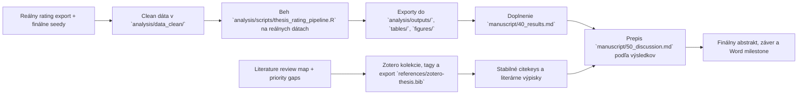

# Aktuálny stav diplomovky

> Posledná aktualizácia: 2026-03-30
> Tento súbor je operatívny dashboard. Má ukazovať reálny stav repa, nie želaný stav.

## Verdikt k dnešnému stavu

Práca nie je v počiatočnej fáze. Máš hotový výskumný rámec, revidovaný draft úvodu a metódy, vyčistenú kostru výsledkov, nový rozdelený literature bundle v `docs/literature/` a markdown knižnicu pomocných materiálov pre thesis writing v `docs/resources/thesis-writing-md/`. Kritická cesta je teraz jasnejšia: spraviť z literature bundle reálny Zotero a note workflow, dobudovať 4 slabšie literárne miesta (klinické ukotvenie MDD, content validity rating nástroja, simulated patient literatúru a safety framing), dostať reálne rating dáta do `analysis/data_clean/`, spustiť pipeline na reálnych vstupoch a z toho doplniť výsledky, diskusiu, záver a finálny abstrakt.

## Stav repa po oblastiach

| Oblasť | Stav | Čo už je v repo | Čo chýba na ďalší posun |
| --- | --- | --- | --- |
| Rukopis | `rozpracované` | outline, názov/abstrakt, revidovaný úvod, revidovaná metóda, vyčistená kostra výsledkov, diskusný draft | finálne počty, výsledky z analýzy, doplnenie placeholderov, finálne prepojenie na Word |
| Literatúra | `in_progress` | source map, import checklist, citekey seed workflow, rozdelený literature bundle s klastrami, gapmi, agent taskmi, plánom a `P1 expansion pass` s konkrétnymi citekeys | chýba `references/zotero-thesis.bib`, chýbajú reálne výpisky v `notes/literature/`, treba dostať P1 balík do Zotera a výpiskov |
| Dáta a analýza | `skelet pripravený` | codebook, premenné, hypotézy, R pipeline, CSV šablóny | clean data v `analysis/data_clean/`, beh pipeline na reálnych dátach, exporty do `analysis/outputs/`, `tables/`, `figures/` |
| Písacie podklady | `done` | konvertované materiály v `docs/resources/thesis-writing-md/`, syntetický README a nový brief `docs/guides/master-outline-diplomovky-v2.md` | používať ich pri draftingu, outline a auditovaní sekcií |
| Operatívny tracking | `zavedené` | tento dashboard, backlog, aktualizačné pravidlá pre agentov, workflow README pre literatúru | priebežná údržba po každej väčšej zmene |

## Stav kapitol IMRaD

| Súbor | Stav | Hodnotenie stavu | Najväčší blocker |
| --- | --- | --- | --- |
| `manuscript/10_title_abstract.md` | `rozpracované` | pracovný názov a použiteľný draft abstraktu už existujú | finálne výsledky pre abstrakt |
| `manuscript/20_introduction.md` | `silný draft` | logika IMRaD sedí, explicitné výskumné otázky a hypotézy sú ukotvené, pojmový rámec je čistejšie previazaný s outcome-mi | doplniť Zotero export a prípadné jemné štylistické doladenie |
| `manuscript/30_method.md` | `silný draft` | dizajn, premenné a analytický plán sú dobre pomenované a lepšie previazané s H1-H6 | finálne počty raterov, finálny opis procedúry podľa reálneho zberu |
| `manuscript/40_results.md` | `kostra` | logika prezentácie je čistejšia a lepšie drží poradie hypotéz a reportovacích pravidiel | chýbajú reálne dáta, reliabilita, ICC, modely, tabuľky a grafy |
| `manuscript/50_discussion.md` | `polodraft` | interpretívna kostra a limity sú pripravené | treba ju prepísať podľa skutočných výsledkov, nie podľa hypotetických formulácií |
| `manuscript/60_conclusion.md` | `kostra` | záver má jasný rámec | potrebuje 3-5 finálnych viet po analýze |

## Kritická cesta

## Najdôležitejšie dependency a blokery

| Dependency | Stav | Blokuje | Poznámka |
| --- | --- | --- | --- |
| `references/zotero-thesis.bib` | `chýba` | finálnu kontrolu citekeys a Word workflow | source map je pripravený, ale export ešte nie je v repo |
| Výpisky v `notes/literature/` | `takmer prázdne` | rýchle prepisovanie intro/discussion | zatiaľ je tam len template |
| Mapové literárne medzery A-D | `čiastočne rozpracované` | silnejšiu Method a Discussion | P1 expansion pass už má konkrétne zdroje, ale ešte nie sú pretavené do Zotera a výpiskov |
| Clean ratings dataset | `chýba` | výsledky, tabuľky, grafy, záver | bez neho je `40_results.md` iba šablóna |
| Exporty v `tables/` a `figures/` | `chýbajú` | Word milestone a finálny Results | priečinky existujú, ale sú prázdne |
| Finálne počty raterov/ratingov | `chýbajú` | Method, Results, Abstract | placeholdery ostali v texte |

## Čo môžeš robiť hneď

- zosúladiť Zotero kolekcie a tagy s bundle v `docs/literature/`
- importovať `P1 expansion pass` z `docs/literature/p1_expansion_pass.md` do Zotera
- nastaviť Better BibTeX auto-export do `references/zotero-thesis.bib`
- vytvoriť 8-12 krátkych výpiskov pre must-read jadro a 4 literárne gaps v `notes/literature/`
- pripraviť clean export ratingov do `analysis/data_clean/`
- doplniť finálne počty raterov a ratingov do `manuscript/30_method.md` a `manuscript/40_results.md`
- pri ďalšom draftingu používať aj `docs/guides/master-outline-diplomovky-v2.md`, nie len starší sprievodca a outline
- upravovať úvod a metódu štylisticky, lebo ich logika už stojí

## Čo zatiaľ neriešiť ako finálne

- finálny abstrakt
- finálny záver
- finálne znenie diskusie
- definitívne tabuľky a grafy do Wordu

Tieto časti sú závislé od reálnych analytických výstupov.
