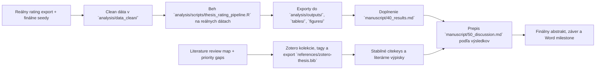

# Aktuálny stav diplomovky

> Posledná aktualizácia: 2026-04-14
> Tento súbor je operatívny dashboard. Má ukazovať reálny stav repa, nie želaný stav.

## Verdikt k dnešnému stavu

Práca nie je v počiatočnej fáze. Máš hotový výskumný rámec, revidovaný draft úvodu, prepracovanú metódu zosynchronizovanú s `H1`–`H9` a `VO1`–`VO8` z Úvodu, a placeholder kostru výsledkov rovnako zosynchronizovanú s `H1`–`H9` / `VO1`–`VO8` a s analytickým plánom v Metóde (časť 2.8), pričom `VO/H` logika je teraz v Úvode, Metóde a Výsledkoch explicitne preskupená po outcome blokoch, hypotézy sú priradené priamo k týmto blokom a `VO4` / `VO5` už nie sú osirelé. Zároveň je už explicitne povedané, že `VO6` je merací blok bez samostatnej hypotézy a `VO7`–`VO8` ostávajú exploračné. Sekcia `1.7` v Úvode je navyše po novom preštylizovaná do fakultne prirodzenejšej podoby `Cieľ výskumu, výskumné otázky a hypotézy`, takže zachováva tú istú analytickú logiku, ale už nepôsobí ako interný drafting note. Hlavné kapitoly rukopisu zároveň prešli normalizačným passom, ktorý odstránil markdown backticky a nepreložené počítačové labels z hlavného textu; vo finálnom prose sa teraz používajú slovenské názvy premenných a len stručné kódy typu G1, R1 alebo R3. Kritická cesta je teraz jasnejšia: Zotero seed workflow je po importe a cleanup-e funkčný, `references/zotero-thesis.bib` obsahuje `120` entries vrátane 6 nových zdrojov z rozšíreného Úvodu (`who2025depression`, `chaby2022embodiedvirtualpatients`, `li2024curefun`, `wang2024patientpsi`, `lee2025adaptivevp`, `kim2025mindvoyager`) a 6 nových zdrojov pre vzdelávací a placement framing (`appeswg2021newreality`, `rice2022simulatedplacements`, `sheen2021simulationeducation`, `glatz2022simulationelements`, `schmidt2025client101`, `morrison2025virtuallypsychologist`). `references/bibliography-notes.md` je rozšírené aj o tento nový blok; pri porovnaní s finálnym bib exportom v ňom ostáva už len pre-existing missing citekey `mchugh2012kappa`. Evidence-anchored poznámkový korpus je rozšírený na `64` notes vrátane nových notes `dubovsky2021psychoticdepression`, `hasson2000delphi`, `rutherfordhemming2015simulationcvi`, `khera2023automationbiasassistiveai` a `marasini2016weightedindexes`; `mchugh2012InterraterReliabilityKappa` je uz prepnuty na lokalny Zotero attachment. Popri tom uz existuje aj explicitny blocker log `docs/literature/missing_fulltext_for_notes.md`, kde uz nie su otvorene missing attachmenty a ostava v nom len technicky `OCR / extraction blocker` pre `lynn1986contentvalidity`. Vzdelávací framing je už pretavený priamo do `manuscript/20_introduction.md`, `manuscript/50_discussion.md` a čiastočne aj do `manuscript/60_conclusion.md`, pričom aplikačný presah je teraz formulovaný prednostne ako budúci **simulačný rámec**. V Úvode a Metóde je už explicitne pomenované, že tento rámec stojí na seed scenároch, faktoroch `guardrail` a `profile`, expertnom hodnotení a troch vrstvách outcome-ov; zároveň už existuje aj praktická `source-to-section` mapa pre bloky `1.1`–`1.6` v `docs/literature/source_to_section_map_introduction.md`. Aktuálna fulltext-ready core vetva uz nema otvoreny note gap a secondary attachment backlog je po doplneni PDF zavrety; ostava uz len riesit OCR citatelnost pri `Lynn`. Analyticka vetva ma po novom aj presny export readiness pass v `analysis/rating_export_readiness_checklist.md`, ktory explicitne oddeluje blocker na clean data od blockerov samotnej pipeline, novy pracovny rámec `analysis/expert_content_review_framework.md` pre pilotný expert review položiek a seed scenárov a aj explicitne zafixované rozlíšenie medzi transcript-level PHQ-9 metadata `A1`–`A9` a ľudskými ratingmi `G*`, `S*`, `R*`. Ďalší reálny posun je dostať reálne rating dáta do `analysis/data_clean/`, prepísať štyri expertné review formuláre do pripravených CSV šablón a z toho doplniť Results, diskusiu, záver a finálny abstrakt.

Krátky authoring-ready update: Úvod prešiel dodatočným citačným a terminologickým spevnením. V `1.1` je doplnený klinickejší anchor k diferenciálnej opatrnosti pri depresívnej prezentácii, v `1.2` je framing simulated placements formulovaný opatrnejšie, v `1.3` je explicitne povedané, že ide o simulačné a tréningové použitie, nie o klinické nasadenie, a v `1.4`–`1.5` je doplnený most medzi obsahovým zdôvodnením domén a neskorším psychometrickým hodnotením cez `[@boateng2018scaledevelopment]`. Zároveň je odstránená terminologická kolízia medzi faktorom štýlu odpovedania a defektovými položkami: manipulačný faktor teraz konzistentne používa úrovne `P1`–`P3`, zatiaľ čo položky indexu defektov ostávajú `R1`–`R5`. Analytická pipeline má po novom aj vizuálnu preview vrstvu v `tables/styled_preview/`, ktorá po každom behu generuje HTML náhľady Tabuľky 1-6 a spoločný `results_preview.html` s hlavnými obrázkami; layout je zámerne priblížený bakalárskemu vzoru, teda caption nad objektom, bez zvislých čiar a s horizontálnymi oddeľovačmi. Popri tom pribudol aj rýchly Word test build `tools/build_results_tables_preview_docx.py`, ktorý z aktuálnych CSV tabuliek vyrenderuje malý `.docx` preview s rovnakou logikou captionov a horizontálnych čiar; v aktuálnej verzii už používa aj slovenské labely z `analysis/codebook_rating_study.csv`, širšie textové stĺpce pre menej agresívne lámanie a poznámky pod vybranými tabuľkami v štýle `Poznámka.`.

## Stav repa po oblastiach

| Oblasť | Stav | Čo už je v repo | Čo chýba na ďalší posun |
| --- | --- | --- | --- |
| Rukopis | `rozpracované` | outline, preferovaný názov práce `Kvalita simulovaných klinických interview s depresívnou symptomatikou generovaných veľkým jazykovým modelom`, preštylizovaný a menej uzamykajúci draft slovenskej anotácie a zosúladený EN abstract, revidovaný úvod s integrovanými hĺbkovými evidence blokmi v 1.2-1.5 a s novým vzdelávacím/placement framingom v 1.2 a 1.6, dodatočne spevnený authoring-ready pass v Úvode (klinickejší MDD/differential anchor v 1.1, opatrnejší framing simulated placements v 1.2, explicitný training-only disclaimer v 1.3, metodický bridge cez `boateng2018scaledevelopment` v 1.4-1.5), sekcia `1.7` už štylisticky prečistená do fakultne bežnejšej podoby `Cieľ výskumu, výskumné otázky a hypotézy`, prepracovaná metóda zosúladená s `H1`–`H9` / `VO1`–`VO8` a s vyplnenými procedurálnymi placeholdermi v 2.7, explicitne zafixovaná os **simulačného rámca** (`seedy -> guardrail/profile -> expert-rated hodnotenie -> plausibility/symptom fidelity/defect`), nový blok o **predbežnej expertnej obsahovej kontrole** položiek a seed scenárov v 2.4.4, konzistentné rozlíšenie `P1`–`P3` pre faktor štýlu odpovedania vs. `R1`–`R5` pre defektové položky naprieč rukopisom, novšie aj explicitné rozlíšenie transcript-level PHQ-9 metadata `A1`–`A9` vs. ľudské ratingy `G*`, `S*`, `R*`, plus nová explicitná veta, že `S1/S2` ostávajú v jadre ako samostatná ľudská vrstva a `severity_error` / `impact_error` sa po zarovnaní seed anchors rátajú priamo na `1-5` škále, nová podsekcia 2.5.8 už explicitne odlišuje jazyk `priemer / medián / distribúcia / pravdepodobnosť vyššieho skóre` podľa typu premennej a časť 2.6 je prepísaná do čistejšieho komparačného empirického jazyka, `VO/H` logika ostáva preskupená po outcome blokoch a placeholder kostra výsledkov explicitne mapuje `VO1`–`VO8` na sekcie 3.2–3.7 vrátane miesta pre pilotný expert review pass v 3.3, diskusný draft posilnený o praktický prínos pre psychologické vzdelávanie a o jemne formulovaný aplikačný presah v podobe simulačného rámca, silnejší záver, nový štýlový normalizačný pass cez `10_title_abstract.md`, `20_introduction.md`, `30_method.md`, `40_results.md`, `50_discussion.md` a `60_conclusion.md`, a upravený Word build workflow (`tools/build_word_preview.sh`, `tools/build_word_clean.sh`, `tools/drop_drafting_notes.lua`), ktorý z exportov odstraňuje interné draftingové blockquote poznámky a `Doplniť:` bloky | finálny počet raterov v 2.2.2, reálne výsledky z analýzy, doplnenie `[doplniť ...]` placeholderov v 3.x, prepis 4 expertných review formulárov do CSV a finálne prepojenie na Word |
| Literatúra | `in_progress` | source map, import checklist, citekey seed workflow, rozdelený literature bundle s klastrami, gapmi, agent taskmi, plánom, `P1 expansion pass`, audit seed workflow v `docs/literature/bbt_seed_audit_2026-04-06.md`, importér `references/scripts/import_bibliography_notes_to_zotero.py`, cleanup script `references/scripts/cleanup_zotero_duplicates_and_enable_export.py`, export script `references/scripts/export_cleaned_collection_to_bib.py`, script na prvé roztriedenie do subkolekcií `references/scripts/assign_zotero_subcollections.py`, script na sync hlavnej kolekcie `references/scripts/sync_zotero_root_collection.py`, script na manuálne thesis tagy `references/scripts/assign_zotero_tags.py`, script na current audit attachmentov `references/scripts/report_zotero_fulltext_status.py`, finálny export `references/zotero-thesis.bib` s 120 entries, zosúladený `references/zotero-thesis-seed.bib`, prvý batch roztriedenia nových zdrojov do relevantných subkolekcií, sync hlavnej kolekcie so subkolekciami, manuálne priority + tematické tagy pre jadro citekey-ready zdrojov, dnešný fulltext checklist v `docs/literature/fulltext_checklist_2026-04-08.md`, priebezny blocker log v `docs/literature/missing_fulltext_for_notes.md`, 64 evidence-anchored výpiskov v `notes/literature/`, workflow pravidlá pre validovateľné notes zapísané v `AGENTS.md`, `docs/literature/README.md` a `references/zotero_import_checklist.md`, a nová `source-to-section` mapa pre Úvod v `docs/literature/source_to_section_map_introduction.md` | ďalej rozširovať evidenčné výpisky a priebežne dočisťovať secondary literature gaps; pri `mchugh` ostáva este citekey drift medzi `bibliography-notes` a finálnym exportom, pri `Lynn` ostava technicky OCR/extraction blocker |
| Dáta a analýza | `pilotný clean run hotový, inferencia zatiaľ blokovaná vzorkou` | codebook, premenné, hypotézy, R pipeline, CSV šablóny, readiness checklist v `analysis/rating_export_readiness_checklist.md`, nový rámec `analysis/expert_content_review_framework.md`, templates pre pilotný expert review položiek a seed scenárov, nový `analysis/pipeline_outputs_plan.md`, ktorý explicitne oddeľuje jadro (`ICC`, `LMM`, `CLMM`) od doplnkových transcript-level Spearman korelácií a exploratívnej `PAM` typológie transkriptov, patchnutý `analysis/scripts/thesis_rating_pipeline.R`, a prvý clean pilotný dataset v `analysis/data_clean/` s úspešným runom nad malou 1-rater vzorkou | doplniť ďalších raterov a balans `guardrail × profile`, potom znovu pustiť pipeline a až následne interpretovať inferenčné exporty do `analysis/outputs/`, `tables/`, `figures/` |
| Písacie podklady | `done` | konvertované materiály v `docs/resources/thesis-writing-md/`, syntetický README a nový brief `docs/guides/master-outline-diplomovky-v2.md` | používať ich pri draftingu, outline a auditovaní sekcií |
| Word build pipeline | `preview + plan B hotový` | tri paralelné build skripty: `tools/build_word_preview.sh` (pandoc + citeproc + APA 7 CSL → `diplomovka_preview.docx`, plné číslovanie a raw heading levels), `tools/build_word_clean.sh` (rovnaký pipeline + Lua filter `tools/strip_heading_numbers.lua`, ktorý zhodí file-level h1, odstráni numerické prefixy a posunie heading levels o -1 → `diplomovka_clean.docx`, pripravený na paste do cieľového Word template-u cez `Cmd+Ctrl+V → Use Destination Styles`) a nový `tools/build_word_plan_b_citekeys.sh` (pandoc bez `--citeproc` + rovnaký Lua filter → `diplomovka_plan_b_citekeys.docx`, teda clean Word export s ponechanými `[@citekey]` placeholdermi pre ručné nahradenie cez Zotero plugin vo Worde), bibliography placeholder `# Literatúra` + `::: {#refs} :::` v `manuscript/60_conclusion.md`, `.gitignore` ignoruje všetky tri preview `.docx` aj Word lockfiles | pre finálnu submission prejsť na oficiálny Word workflow z `AGENTS.md` sekcia 11 (`Add/Edit Citation` cez Zotero plugin), nájsť alebo pripraviť FF UK template a reference docx pre nadpisové štýly |
| Operatívny tracking | `zavedené` | tento dashboard, backlog, aktualizačné pravidlá pre agentov, workflow README pre literatúru a nová pracovná mapa `docs/vo_h_model_results_map.md` pre väzbu `blok -> VO -> H -> premenné -> model -> Results` | priebežná údržba po každej väčšej zmene |

## Rýchly rozcestník analýzy a výstupov

| Miesto | Funkcia | Stav |
| --- | --- | --- |
| `analysis/data_clean/` | finálne clean vstupy pre ostrý analytický beh | aktuálne len README, chýbajú reálne CSV |
| `analysis/templates/` | šablóny a smoke-run fallback vstupy pre pipeline | pripravené |
| `analysis/scripts/thesis_rating_pipeline.R` | hlavný R skript pre QC, deskriptíva, reliabilitu, mixed modely, supplement a exporty | patchnutý na robustný run s fallbackom na templates |
| `analysis/pipeline_outputs_plan.md` | autoritatívny rozpis toho, čo má pipeline exportovať a kam | pripravené |
| `analysis/outputs/run_manifest.csv` | prvé miesto na kontrolu, z akého zdroja bežal posledný run a koľko riadkov reálne spracoval | aktuálne ukazuje `templates_smoke_run` |
| `analysis/outputs/` | technické a analytické CSV medzivýstupy | určené pre pipeline run |
| `tables/` | manuscript-ready a supplement-ready tabuľky | určené pre pipeline run |
| `figures/` | manuscript-ready a supplement-ready grafy | určené pre pipeline run |
| `manuscript/30_method.md` | thesis-ready opis analytického plánu | zosúladené s pipeline planom |
| `manuscript/40_results.md` | placeholder kostra Results s miestami pre tabuľky, grafy a čísla | čaká na reálne outputy |
| `docs/backlog-diplomovky.md` | operatívne poradie práce a definition of done | aktuálne |

## Stav kapitol IMRaD

| Súbor | Stav | Hodnotenie stavu | Najväčší blocker |
| --- | --- | --- | --- |
| `manuscript/10_title_abstract.md` | `rozpracované` | preferovaný názov je zafixovaný ako `Kvalita simulovaných klinických interview s depresívnou symptomatikou generovaných veľkým jazykovým modelom`; slovenská anotácia je preštylizovaná do menej uzamykajúcej verzie a EN abstract je s ňou obsahovo zosúladený | finálne výsledky pre finálny abstrakt a záver |
| `manuscript/20_introduction.md` | `silný draft + integrované evidence blocky` | prepracovaný podľa rozšíreného draftu: pod `## 1 Úvod` je po novom krátky orientačný lead-in v rozsahu približne 1-2 strany, ktorý v štýle bežných DP uvádza predmet práce, praktický a metodologický význam témy, rámec simulačného použitia a logiku nasledujúcich podkapitol; ďalej 1.1 depresívna symptomatika, 1.2 klasické simulované patienty a novší psychologický education/placement framing (APPESWG, simulated placements, confidence/readiness štúdie, virtual client tools), 1.3 LLM simulovaní pacienti s konkrétnymi benchmarkmi (CureFun B-ELO +250 pre GPT-3.5 + role flipping/halucinácie; PATIENT-ψ µ=1,3, p<10⁻⁴, n=33 zložené z 20 expertov + 13 stážistov, „too forthcoming" GPT-4 baseline; Adaptive-VP F(1,24,7)=8,42, p=,008, n=28 sestier, EFA s Cronbachovým α nad 0,95), 1.4 expertná evaluácia + COSMIN + obhajoba malých expertných vzoriek (Wang n=33 ako kognitívne náročná úloha; Spearmanovo ρ ≈ 0,81 medzi LLM-as-judge a expertom z CureFun), 1.5 pojmový rámec s posilnenou MindVoyager citáciou (openness × metakognícia ako dvojrozmerný framework, cognitive diagram + cognition mediator architektúra, prompt engineering pre low-openness/low-metacognition nedosiahne ≤4,28/4,15 zo 5), 1.6 výskumná medzera rozšírená o metodologický, edukačný a jemne formulovaný aplikačný presah v podobe simulačného rámca, 1.7 cieľ/VO1-VO8/H1-H9 teraz preskupené po blokoch skúmaných premenných a hypotézy sú priradené priamo k blokom `VO`; `VO6` je explicitne nehypotetické a `VO7` / `VO8` exploračné; citekeys z aktuálneho draftu sedia s `references/zotero-thesis.bib` | štylistické doladenie a finálne vyladenie pre Word submission |
| `manuscript/30_method.md` | `silný draft` | dizajn, premenné a analytický plán sú zosúladené s `H1`–`H9` / `VO1`–`VO8` z Úvodu, sekcia 2.5 obsahuje čisté formuly pre `plausibility_index`, `defect_index`, `symptom_error_mean`, `severity_error`, `impact_error` a po novom aj explicitný preklad medzi typom premennej a jazykom reportu (`priemer`, `medián`, `distribúcia`, `pravdepodobnosť vyššieho skóre`), časť 2.6 už nehovorí všeobecne o „vzťahoch“, ale formuluje empirické otázky a hypotézy v komparačnom jazyku zodpovedajúcom operacionalizácii a typu modelu, časť 2.8 pomenúva väzbu modelov na `VO1`–`VO8`, časť 2.7 má vyplnené tri procedurálne placeholdery (variabilný počet raters per transcript s minimom 2, blokovo randomizované poradie balansované cez `guardrail × profile`, explicitná disclosure AI-pôvodu hodnotiteľom) a v 2.4.4 je po novom explicitne zachytený pilotný expert review pass položiek a seed scenárov | doplniť `[doplniť finálny počet]` raterov v 2.2.2, prepísať reálne 4 expert review formuláre a prípadne finálne vyladenie po reálnom zbere |
| `manuscript/40_results.md` | `placeholder kostra zosúladená s H1-H9` | 3.1 explicitná mapa `VO1`–`VO8` na výsledkové sekcie + 3.2 dataset (`VO1`, časť `VO2`) + 3.3 pilotný expert review pass položiek a seed scenárov spolu s frekvenciami/α/ω + 3.4 ICC (`VO6`) + 3.5 jadro `H1`–`H5` ako priamy príspevok k `VO1` / `VO2` + 3.6 rozšírené `H6`–`H9` (`VO3`–`VO5`, `profile`, interakcia), pričom 3.6.3 a 3.6.4 explicitne uzatvárajú aj predtým slabšie pokryté `VO4` a `VO5` + 3.7 doplnkové `VO7` / `VO8` + 3.8 sumarizačné zhrnutie; všetky premenné, modely a citekeys identické s 2.8 v Metóde | chýbajú reálne dáta, čísla pre `[doplniť ...]` sloty, stručné zhrnutie 4 expert review formulárov, ICC hodnoty, odhady mixed modelov, Tabuľky 1–6 a Obrázky 1–2 |
| `manuscript/50_discussion.md` | `silnejší polodraft` | interpretívna kostra, limity a praktické dôsledky sú pripravené; sekcie 4.4, 4.5, 4.7 a 4.8 už obsahujú explicitný psychologicko-vzdelávací framing a jemne formulovaný aplikačný presah k budúcemu simulačnému rámcu | treba ju prepísať podľa skutočných výsledkov, nie podľa hypotetických formulácií |
| `manuscript/60_conclusion.md` | `silnejšia kostra` | záver má jasný rámec a už obsahuje aj opatrne formulovaný bridge k budúcemu simulačnému rámcu | potrebuje 3-5 finálnych viet po analýze |

## Kritická cesta

## Najdôležitejšie dependency a blokery

| Dependency | Stav | Blokuje | Poznámka |
| --- | --- | --- | --- |
| `references/zotero-thesis.bib` | `done` | nič blokujúce | finálny cleaned export už reálne existuje v repo a sedí s current bibliography-notes workflow; hlavná Zotero kolekcia je zosynchronizovaná so subkolekciami a core zdroje majú manuálne thesis tagy |
| `references/zotero-thesis-seed.bib` | `done` | nič blokujúce | helper seed je zosúladený s finálnym exportom; `bibliography-notes` je rozšírené o nový education/placement blok, pričom v plnom exporte stále chýba už len pre-existing `mchugh2012kappa` |
| Výpisky v `notes/literature/` | `in_progress` | rýchle prepisovanie intro/discussion | existuje už 64 evidence-anchored note súborov vrátane 6 nových výpiskov pre psychologické vzdelávanie, simulated placements a virtual client training (`appeswg2021newreality`, `rice2022simulatedplacements`, `sheen2021simulationeducation`, `glatz2022simulationelements`, `schmidt2025client101`, `morrison2025virtuallypsychologist`), nového klinického note pre `guidi2011clinicalinterviewdepression`, nového metodického note pre `polit2007cvi`, nového systematického anchor note pre `cook2010computerizedvirtualpatients`, nového explanatory-method note pre `mchugh2012InterraterReliabilityKappa`, novych notes `dubovsky2021psychoticdepression`, `hasson2000delphi`, `rutherfordhemming2015simulationcvi`, `khera2023automationbiasassistiveai`, `marasini2016weightedindexes` a troch dalsich metodickych notes `dinnesen2020CollaboratingExpertPanel`, `landeta2024QualityIndicatorsDelphi`, `woodcock2020ModifiedDelphiStudy`; workflow štandard je `opiera sa o + locator + väčší kontextový excerpt + parafráza + use`; 5 z 6 nových intro-expansion notes (`chaby2022embodiedvirtualpatients`, `li2024curefun`, `wang2024patientpsi`, `lee2025adaptivevp`, `kim2025mindvoyager`) má teraz hlboké evidence blocky z plných PDF s page locatormi, šiesty (`who2025depression`) zostáva pri HTML fact sheet excerptoch ako dostatočný; `sheen2021simulationeducation` je uzavretý ako realny PDF-based note bez `manual check`; missing attachment backlog je zavrety a v blocker logu ostava uz len OCR problem pri `lynn1986contentvalidity` |
| Mapové literárne medzery A-D | `in_progress` | silnejšiu Method a Discussion | P1 expansion pass je už importnutý do Zotera, pretavený do čistého exportu a prvotne roztriedený do subkolekcií, ale ešte treba spraviť výpisky |
| Nové literárne medzery F-I (6 zdrojov z rozšíreného Úvodu) | `resolved` | nič blokujúce | `who2025depression`, `chaby2022embodiedvirtualpatients`, `li2024curefun`, `wang2024patientpsi`, `lee2025adaptivevp`, `kim2025mindvoyager` sú importnuté do Zotera, zahrnuté v `references/zotero-thesis.bib` (aktuálne 120 entries), placeholdery v `manuscript/20_introduction.md` sa zosúladili s bibom (0 missing, overené regexom) a pre každý z nich existuje evidence-anchored výpisk v `notes/literature/`; backlog `B22` a `B23` sú `done` |
| Clean ratings dataset | `chýba` | výsledky, tabuľky, grafy, záver | bez neho je `40_results.md` iba šablóna |
| Pipeline smoke-run na templates | `done` | odstraňuje čisto technický blocker pipeline | smoke-run na templates prešiel; pipeline už nie je blokovaná len technicky |
| Pilotný clean run na 1-rater dátach | `done` | oddeľuje technický stav pipeline od limitu vzorky | `analysis/data_clean/` je dočasne naplnené pilotným exportom od 1 ratera a `analysis/outputs/run_manifest.csv` už ukazuje `data_clean`; výsledky sú použiteľné na QC a descriptives, nie na inferenčnú interpretáciu |
| Exporty v `tables/`, `tables/styled_preview/` a `figures/` | `template smoke artefakty existujú` | finálny Results a Word milestone na reálnych dátach | pipeline už vytvorila smoke-run CSV/PNG artefakty a novy HTML preview layer s thesis-style captionmi a horizontálnymi čiarami; pre manuscript su tieto artefakty obsahovo použiteľné až po ostrom behu nad clean dátami |
| Finálne počty raterov/ratingov | `chýbajú` | Method, Results, Abstract | placeholdery ostali v texte |

## Čo môžeš robiť hneď

- v Zotere len rýchlo manuálne overiť, že 12 nových zdrojov z rozšíreného Úvodu a vzdelávacieho framingu sedí aj v tematických subkolekciách a thesis tagoch; skripty na subcollections/tagy už boli aplikované
- rozširovať výpisky mimo fulltext-ready core vetvy na dalsie should-read a mapove gaps
- rozširovať výpisky z aktuálnych 64 evidence-anchored notes na celé must-read jadro a na zostávajúce literárne gaps v `notes/literature/`
- pri dalsich blokeroch pouzivat `docs/literature/missing_fulltext_for_notes.md`, momentalne je v nom uz len OCR problem pri `lynn1986contentvalidity`
- jemne doladiť priority/tagy a prípadné sekundárne subkolekcie pre širší thesis corpus
- pripraviť clean export ratingov do `analysis/data_clean/` podľa `analysis/rating_export_readiness_checklist.md`
- pri patchovaní pipeline sa držať nového `analysis/pipeline_outputs_plan.md`, najprv pre jadro (`ICC`, `LMM`, `CLMM`) a až v druhom passe pre transcript-level Spearman a `PAM`; pri `S1/S2` už používať priamy `1-5` error výpočet voči anchorom
- prepísať 4 expertné review formuláre položiek a seed scenárov do nových šablón v `analysis/templates/` a pripraviť ich clean verziu do `analysis/data_clean/`
- doplniť finálny počet raterov v `manuscript/30_method.md` (placeholder v 2.2.2) a `manuscript/40_results.md` (sloty v 3.2)
- po behu pipeline doplniť reálne hodnoty do `[doplniť ...]` slotov v `manuscript/40_results.md` (sekcie 3.3 α/ω, 3.4 ICC, 3.5 jadro `H1`–`H5`, 3.6 `H6`–`H9`, 3.7 doplnkové)
- pri ďalšom draftingu používať aj `docs/guides/master-outline-diplomovky-v2.md`, nie len starší sprievodca a outline
- upravovať úvod a metódu štylisticky, lebo ich logika už stojí
- po dokončení reálnych výsledkov prepísať `manuscript/50_discussion.md` tak, aby reagoval na reálne hodnoty pre `H1`–`H9` a interpretoval ich v rámci `VO1`–`VO8`
- generovať priebežný Word preview cez `./tools/build_word_preview.sh` (výstup `diplomovka_preview.docx`, plné číslovanie), `./tools/build_word_clean.sh` (výstup `diplomovka_clean.docx`, bez čísel a so shiftnutými heading levelmi pre paste do cieľového Word template-u cez `Cmd+Ctrl+V → Use Destination Styles`) alebo `./tools/build_word_plan_b_citekeys.sh` (výstup `diplomovka_plan_b_citekeys.docx`, rovnaký clean layout, ale s ponechanými `[@citekey]` placeholdermi pre ručné nahradenie cez Zotero plugin); všetky tri výstupy sú ignorované v `.gitignore`, pričom validačný check missing citekeys voči `references/zotero-thesis.bib` zostáva doménou preview/clean buildu s `citeproc`
- použiť `notes/meetings/2026-04-08-skolitelka-vzdelavaci-framing-plan.md` už skôr ako podklad na redukciu, obhajobu a prezentáciu, lebo vzdelávací framing a línia simulačného rámca sú už zapracované do rukopisu

## Čo zatiaľ neriešiť ako finálne

- finálny abstrakt
- finálny záver
- finálne znenie diskusie
- definitívne tabuľky a grafy do Wordu

Tieto časti sú závislé od reálnych analytických výstupov.
