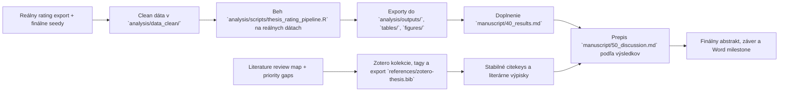

# Aktuálny stav diplomovky

> Posledná aktualizácia: 2026-04-20
> Tento súbor je operatívny dashboard. Má ukazovať reálny stav repa, nie želaný stav.

## Verdikt k dnešnému stavu

Práca je po obsahovej aj workflow stránke ďaleko za počiatočnou fázou. Úvod a Metóda sú zosúladené s `H1`–`H9` a `VO1`–`VO8`, terminológia je prečistená do thesis-ready jazyka a literárny workflow je stabilizovaný cez Zotero, `references/zotero-thesis.bib`, evidence-anchored výpisky a source-to-section mapy. V repo už zároveň existuje deterministická QC vrstva aj agentový nadstavbový review, ale hranica zostáva zachovaná: zdrojom pravdy pre štatistiku je pipeline a exportované CSV, nie LLM prose.

Najdôležitejší posun dňa je autoritatívny clean run na plnom rating exporte. `analysis/data_clean/` je už naplnené reálnymi clean vstupmi a `analysis/outputs/run_manifest.csv` teraz reportuje `source_mode = data_clean`, `n_rows_analysis_long = 166`, `n_raters = 6`, `n_transcripts = 72` a `n_seeds = 12`. Hlavná pipeline `analysis/scripts/thesis_rating_pipeline.R` na týchto dátach prešla, obnovila `analysis/outputs/`, `tables/` aj `figures/` a clean ingest je reprodukovateľný cez `analysis/scripts/import_current_export_to_data_clean.py`. Metóda už má doplnený finálny počet hodnotiteľov a preview/QC workflow je zosúladený s auditom anchor vetvy, explicitným estimatorom `omega total (1f)` a so známym raw validačným CSV issue.

Praktická kritická cesta sa tým posunula o krok ďalej. Najbližší reálny blocker už nie je dostať dáta do `analysis/data_clean/` ani rozbehať pipeline, ale prepísať hlavné `manuscript/40_results.md` a následne `manuscript/50_discussion.md` z pilot-safe wording-u na text, ktorý reportuje full-run počty a modelové výstupy. QC vrstva už preto nemá riešiť falošný problém malého 1-rater datasetu; má strážiť drift medzi autoritatívnymi outputmi a manuskriptom. Na tento posledny krok uz teraz existuju styri explicitne artefakty: `analysis/final_run_playbook.md` pre ingest -> pipeline -> QC -> Word workflow, `manuscript/40_results_full_run_staging.md` ako pre-final scaffold pre posledny prepis Results, `docs/next-chat-final-run-handoff.md` ako odovzdavaci dokument a `prompts/next_chat_final_run_prompt.md` ako copy-paste prompt pre dalsi chat.

Novy workflowovy posun uz nie je len na urovni planu, ale aj implementacie. V repozitari pribudla deterministic QC vrstva pre thesis workflow: `analysis/scripts/run_thesis_qc.py`, `analysis/scripts/qc_hard_checks.py`, `analysis/scripts/qc_models.py` a `analysis/scripts/qc_report.py`, plus README v `analysis/qc_reports/` a testy v `tests/test_thesis_qc.py`. Tento runner kontroluje clean data a joins, projekciu medzi `analysis/outputs/*.csv` a `tables/*.csv`, validitu citekey placeholderov voči `references/zotero-thesis.bib` a stav manuscript artefaktov voči aktuálnym outputom. Po aktuálnom autoritatívnom rune prechádza `smoke` aj `pre_word` bez blockerov; známy raw snapshot problém v `analysis/validity data/data.csv` ostáva evidovaný len ako neblokujúca poznámka, keďže source of truth je `data.xlsx`.

## Delta po štatistickom audite 2026-04-20

- `current-export preview` bol porovnaný s nezávislým audit workbookom; anchor fidelity vetva sa má držať transcript-level sumarizácie, nie rating-weighted reportovania.
- `McDonaldova omega` má byť v preview a workflow dokumentoch viazaná na explicitný estimator `omega total (1f)`; voľné miešanie viacerých verzií bolo identifikované ako redakčný drift.
- raw `analysis/validity data/data.csv` ostáva technicky nečistý export; za source of truth treba považovať `data.xlsx` a clean CSV v `analysis/data_clean/`, nie poškodený raw CSV snapshot.
- pre raw validačný export už existuje reprodukovateľná oprava `analysis/scripts/repair_validation_csv.py`, ktorá oreže/pad-ne riadky na šírku hlavičky a vytvorí `analysis/validity data/data_repaired_trimmed.csv` bez ručného zásahu.
- `current-export preview` zostáva authoring pomôcka naviazaná na externý wide export mimo tracked clean-run workflowu; kým nemá vlastný preview QC scope, nie je to Word-ready autoritatívny build.
- pre bezpečné upratanie generovaných preview/QC artefaktov pred ďalším buildom už existuje `tools/pre_final_run_housekeeping.sh`; skript robí defaultne dry-run a pri `--apply` maže len známe nereferencované generované súbory, nie tracked alebo obsahové zmeny.

Na tejto vrstve uz dnes sedi aj prva agentovo-orchestracna nadstavba. V repozitari pribudol `analysis/scripts/qc_agents.py` a prompty v `prompts/qc/` pre tri role: `citation_support_agent`, `stats_claim_agent` a `results_presentation_agent`. Runner ich vie spustat cez `--agent-mode off|mock|pydantic_ai`. Lokalne je overeny `mock` backend, ktory drzi typed kontrakty a orchestrator flow bez zavislosti na sieti, a `pydantic_ai` vrstva je funkcna v lokalnom `.venv-ai-tools` env s auto-loadom repo `.env` a fail-closed spravanim pri provider/runtime/output chybe. Po aktualnom autoritativnom rune uz agentova vrstva nesignalizuje obsahovy drift medzi CSV outputmi a kontrolovanymi Results artefaktmi; zostavaju len redakcne alebo workflow poznamky, nie falosne inferencne alarmy.

Ako prechodný authoring krok vznikli aj dva nové preview drafty viazané na aktuálny 166-rating export z `Downloads`: `manuscript/40_results_preview_current_export.md` a `manuscript/50_discussion_preview_current_export.md`. Ich funkciou nie je nahradiť autoritatívne `40_results.md` a `50_discussion.md`, ale ukázať, ako by vyzeral Results a Discussion prose pri súčasných dátach bez toho, aby sa rozbila repo konzistencia medzi preview workflowom a autoritatívnym clean runom. Kritická hranica tým ostáva zachovaná: preview drafty sú manuskriptová pomôcka, nie zdroj pravdy pre QC ani Word finalizáciu.

Tento current-export preview workflow je po novom aj podstatne bohatší. V repozitári pribudol skript `analysis/scripts/build_current_export_preview_assets.R`, ktorý z aktuálneho wide exportu generuje samostatné markdown fragmenty tabuliek a nové PNG grafy do `tables/current_export_preview/` a `figures/current_export_preview/`, a wrapper `tools/build_word_preview_current_export.sh`, ktorý ich vloží do preview Results a vyrenderuje samostatný Word súbor `diplomovka_preview_current_export.docx`. Preview Results a Discussion drafty boli zároveň prehĺbené: Results už obsahuje silnejšiu deskriptívnu vrstvu, distribučné a cell-level interpretácie, explicitnejší rater-layer blok, integrovaný validačný blok predbežnej expertnej obsahovej kontroly položiek a seed scenárov a po novom aj plnú 12-seed symptom-fidelity vetvu current-export buildu cez `analysis/seed_anchors_final.csv`; validačný blok už navyše neostáva len v prose, ale current-export Word preview doň vkladá aj supplementové tabuľky `S4` a `S5` a heatmapy `S3` a `S4`. Stále však ostáva explicitne oddelené, že ide o preview workflow mimo autoritatívneho clean-run pathu v `analysis/data_clean/`. Preview vizuálna vrstva navyše už generuje aj tri alternatívy pre ordinálne sekundárne outcome-y po bunkách (`boxplot + jitter`, stacked frekvenčné profily a heatmapu podielov odpovedí), aby sa pri položkách s nulovým `IQR` dalo vybrať čitateľnejšie zobrazenie než samotný boxplot. Zároveň už neostáva rozdiel medzi malým table preview DOCX a plnými manuscript exportmi: spoločný preset v `tools/docx_table_style.py` a postprocessor `tools/apply_table_style_to_docx.py` sa po novom aplikuje aj na `preview`, `clean`, `plan_b` a `current-export` Word buildy, takže tabuľky majú konzistentné písmo, padding, šírku a horizontálne čiary naprieč všetkými workflowmi.

Nový posun v authoring workflowe je appendix framing: vznikol samostatný súbor `manuscript/70_appendices.md`, ktorý oddeľuje verejné prílohy od neverejných alebo obmedzene šírených balíkov a od čisto interných repo artefaktov. Prakticky to fixuje, že verejný appendix má niesť hlavne ratingový nástroj, operacionalizačnú tabuľku, redigovanú schému seedov, doplnkové tabuľky a grafy a kompaktnú mapu `VO/H -> outcome -> model`, kým AI-only runtime pack, plný seed corpus, transkripty a surové exporty sa nemajú automaticky ťahať do verejného CRZP balíka len preto, že existujú v repo. Tento framing už má aj prvý konkrétny výstup v `manuscript/71_public_appendix_draft.md`, kde je public-safe draft Príloh A-F pripravený ako medzivrstva pre neskorší Word appendix.

Krátky authoring-ready update: Úvod prešiel dodatočným citačným a terminologickým spevnením. V `1.1` je doplnený klinickejší anchor k diferenciálnej opatrnosti pri depresívnej prezentácii, v `1.2` je framing simulated placements formulovaný opatrnejšie, v `1.3` je explicitne povedané, že ide o simulačné a tréningové použitie, nie o klinické nasadenie, a v `1.4`–`1.5` je doplnený most medzi obsahovým zdôvodnením domén a neskorším psychometrickým hodnotením cez `[@boateng2018scaledevelopment]`. Zároveň je odstránená terminologická kolízia medzi faktorom štýlu odpovedania a defektovými položkami: manipulačný faktor teraz konzistentne používa úrovne `P1`–`P3`, zatiaľ čo položky indexu defektov ostávajú `R1`–`R5`. Analytická pipeline má po novom aj vizuálnu preview vrstvu v `tables/styled_preview/`, ktorá po každom behu generuje HTML náhľady Tabuľky 1-6 a spoločný `results_preview.html` s hlavnými obrázkami; layout je zámerne priblížený bakalárskemu vzoru, teda caption nad objektom, bez zvislých čiar a s horizontálnymi oddeľovačmi. Popri tom pribudol aj rýchly Word test build `tools/build_results_tables_preview_docx.py`, ktorý z aktuálnych CSV tabuliek vyrenderuje malý `.docx` preview s rovnakou logikou captionov a horizontálnych čiar; v aktuálnej verzii už používa aj centrálny final-style preset pre písmo, padding, captiony, hrúbku horizontálnych čiar a poznámky pod tabuľkami a preview už zahŕňa nielen jadrové results tabuľky, ale aj validačné tabuľky `S4` a `S5`. Tento preset je po novom vytiahnutý do `tools/docx_table_style.py` a plné Word buildy ho zdedia cez postprocessing hook, takže sa nebude rozchádzať vzhľad tabuliek medzi testovacím a finálnym exportom.

## Stav repa po oblastiach

| Oblasť | Stav | Čo už je v repo | Čo chýba na ďalší posun |
| --- | --- | --- | --- |
| Rukopis | `rozpracované` | outline, preferovaný názov práce `Kvalita simulovaných klinických interview s depresívnou symptomatikou generovaných veľkým jazykovým modelom`, preštylizovaný a menej uzamykajúci draft slovenskej anotácie a zosúladený EN abstract, revidovaný úvod s integrovanými hĺbkovými evidence blokmi v 1.2-1.5 a s novým vzdelávacím/placement framingom v 1.2 a 1.6, authoring-ready pass v Úvode, prepracovaná Metóda zosúladená s `H1`–`H9` / `VO1`–`VO8`, explicitne zafixovaná os **simulačného rámca** (`seedy -> guardrail/profile -> expert-rated hodnotenie -> plausibility/symptom fidelity/defect`), nový blok o **predbežnej expertnej obsahovej kontrole** položiek a seed scenárov v 2.4.4, konzistentné rozlíšenie `P1`–`P3` pre faktor štýlu odpovedania vs. `R1`–`R5` pre defektové položky, explicitné rozlíšenie transcript-level PHQ-9 metadata `A1`–`A9` vs. ľudské ratingy `G*`, `S*`, `R*`, doplnený finálny počet hodnotiteľov v 2.2.2, pilot-safe `40_results.md`, diskusný draft posilnený o praktický prínos pre psychologické vzdelávanie a nový appendix framing v `manuscript/70_appendices.md` a `manuscript/71_public_appendix_draft.md` | prepísať hlavné `40_results.md` a následne `50_discussion.md` podľa autoritatívnych full-run outputov, rozhodnúť o neverejných prílohách a doladiť Word-ready redakciu |
| Literatúra | `in_progress` | source map, import checklist, citekey seed workflow, rozdelený literature bundle s klastrami, gapmi, agent taskmi, plánom, `P1 expansion pass`, audit seed workflow v `docs/literature/bbt_seed_audit_2026-04-06.md`, importér `references/scripts/import_bibliography_notes_to_zotero.py`, cleanup script `references/scripts/cleanup_zotero_duplicates_and_enable_export.py`, export script `references/scripts/export_cleaned_collection_to_bib.py`, script na prvé roztriedenie do subkolekcií `references/scripts/assign_zotero_subcollections.py`, script na sync hlavnej kolekcie `references/scripts/sync_zotero_root_collection.py`, script na manuálne thesis tagy `references/scripts/assign_zotero_tags.py`, script na current audit attachmentov `references/scripts/report_zotero_fulltext_status.py`, finálny export `references/zotero-thesis.bib` s 120 entries, zosúladený `references/zotero-thesis-seed.bib`, prvý batch roztriedenia nových zdrojov do relevantných subkolekcií, sync hlavnej kolekcie so subkolekciami, manuálne priority + tematické tagy pre jadro citekey-ready zdrojov, dnešný fulltext checklist v `docs/literature/fulltext_checklist_2026-04-08.md`, priebezny blocker log v `docs/literature/missing_fulltext_for_notes.md`, 64 evidence-anchored výpiskov v `notes/literature/`, workflow pravidlá pre validovateľné notes zapísané v `AGENTS.md`, `docs/literature/README.md` a `references/zotero_import_checklist.md`, a nová `source-to-section` mapa pre Úvod v `docs/literature/source_to_section_map_introduction.md` | ďalej rozširovať evidenčné výpisky a priebežne dočisťovať secondary literature gaps; pri `mchugh` ostáva este citekey drift medzi `bibliography-notes` a finálnym exportom, pri `Lynn` ostava technicky OCR/extraction blocker |
| Dáta a analýza | `autoritatívny clean run hotový` | codebook, premenné, hypotézy, R pipeline, readiness checklist v `analysis/rating_export_readiness_checklist.md`, nový rámec `analysis/expert_content_review_framework.md`, clean expert review CSV v `analysis/data_clean/`, reprodukovateľný full-export ingest cez `analysis/scripts/import_current_export_to_data_clean.py`, patchnutý `analysis/scripts/thesis_rating_pipeline.R`, plný clean run nad `166` ratingmi / `72` transkriptmi / `12` seedmi / `6` ratermi, obnovené výstupy v `analysis/outputs/`, `tables/` a `figures/`, plus transcript-level anchor reporting a QC hard checks zosúladené s auditom | prepísať manuscript prose podľa autoritatívnych outputov a pri ďalšom exporte len zopakovať ingest + rerun |
| Písacie podklady | `done` | konvertované materiály v `docs/resources/thesis-writing-md/`, syntetický README a nový brief `docs/guides/master-outline-diplomovky-v2.md` | používať ich pri draftingu, outline a auditovaní sekcií |
| Word build pipeline | `preview + plan B hotový` | štyri build skripty: `tools/build_word_preview.sh` (pandoc + citeproc + APA 7 CSL → `diplomovka_preview.docx`, plné číslovanie a raw heading levels), `tools/build_word_clean.sh` (rovnaký pipeline + Lua filter `tools/strip_heading_numbers.lua`, ktorý zhodí file-level h1, odstráni numerické prefixy a posunie heading levels o -1 → `diplomovka_clean.docx`, pripravený na paste do cieľového Word template-u cez `Cmd+Ctrl+V → Use Destination Styles`), `tools/build_word_plan_b_citekeys.sh` (pandoc bez `--citeproc` + rovnaký Lua filter → `diplomovka_plan_b_citekeys.docx`, teda clean Word export s ponechanými `[@citekey]` placeholdermi pre ručné nahradenie cez Zotero plugin vo Worde) a `tools/build_word_preview_current_export.sh` (preview build naviazaný na aktuálny wide export). Všetky štyri už po pandoc exporte púšťajú spoločný postprocessor `tools/apply_table_style_to_docx.py`, ktorý prenesie jednotný table preset z `tools/docx_table_style.py` do plného `.docx`, takže tabuľky majú aj vo full manuscript buildoch rovnaké písmo, padding, šírku a horizontálne čiary ako natívny table preview DOCX. Bibliography placeholder `# Literatúra` + `::: {#refs} :::` ostáva v `manuscript/60_conclusion.md`, `.gitignore` ignoruje preview `.docx` aj Word lockfiles | pre finálnu submission prejsť na oficiálny Word workflow z `AGENTS.md` sekcia 11 (`Add/Edit Citation` cez Zotero plugin), nájsť alebo pripraviť FF UK template a reference docx pre nadpisové štýly |
| Operatívny tracking | `zavedené` | tento dashboard, backlog, aktualizačné pravidlá pre agentov, workflow README pre literatúru a nová pracovná mapa `docs/vo_h_model_results_map.md` pre väzbu `blok -> VO -> H -> premenné -> model -> Results` | priebežná údržba po každej väčšej zmene |

## Rýchly rozcestník analýzy a výstupov

| Miesto | Funkcia | Stav |
| --- | --- | --- |
| `analysis/data_clean/` | finálne clean vstupy pre ostrý analytický beh | aktuálne obsahuje pilotný clean dataset od 1 ratera a aj clean expert review pass pre položky a seedy; na finálny run treba doplniť ďalších raterov |
| `analysis/templates/` | šablóny a smoke-run fallback vstupy pre pipeline | pripravené |
| `analysis/scripts/thesis_rating_pipeline.R` | hlavný R skript pre QC, deskriptíva, reliabilitu, mixed modely, supplement a exporty | patchnutý na robustný run s fallbackom na templates |
| `analysis/README.md` | stručný rozcestník analýzy vrátane mapy `R` balíkov a helper `Python` vrstvy | aktuálne |
| `analysis/statistical_calculations_for_statistician_review.md` | briefing pre štatistika: validačné výpočty, hlavné modely, vzorce a mapovanie na hypotézy | aktuálne |
| `analysis/pipeline_outputs_plan.md` | autoritatívny rozpis toho, čo má pipeline exportovať a kam | pripravené |
| `analysis/outputs/run_manifest.csv` | prvé miesto na kontrolu, z akého zdroja bežal posledný run a koľko riadkov reálne spracoval | aktuálne ukazuje autoritatívny `data_clean` run s `166` ratingmi, `6` ratermi, `72` transkriptmi a `12` seedmi |
| `analysis/outputs/` | technické a analytické CSV medzivýstupy | obsahuje aj summary expert review passu nad validity dátami |
| `tables/` | manuscript-ready a supplement-ready tabuľky | okrem pipeline tabuliek už obsahuje aj `table_s4` a `table_s5` pre expert review pass |
| `figures/` | manuscript-ready a supplement-ready grafy | okrem pipeline grafov už obsahuje aj `figure_s3` a `figure_s4` pre expert review pass |
| `manuscript/30_method.md` | thesis-ready opis analytického plánu | zosúladené s pipeline planom |
| `manuscript/40_results.md` | pilot-safe draft Results, ktorý už treba prepísať na full-run verziu | autoritatívne outputy už existujú v `analysis/outputs/`, ale hlavný Results text ich ešte nereportuje |
| `docs/backlog-diplomovky.md` | operatívne poradie práce a definition of done | aktuálne |

## Stav kapitol IMRaD

| Súbor | Stav | Hodnotenie stavu | Najväčší blocker |
| --- | --- | --- | --- |
| `manuscript/10_title_abstract.md` | `rozpracované` | preferovaný názov je zafixovaný ako `Kvalita simulovaných klinických interview s depresívnou symptomatikou generovaných veľkým jazykovým modelom`; slovenská anotácia je preštylizovaná do menej uzamykajúcej verzie a EN abstract je s ňou obsahovo zosúladený | finálne výsledky pre finálny abstrakt a záver |
| `manuscript/20_introduction.md` | `silný draft + integrované evidence blocky` | prepracovaný podľa rozšíreného draftu: pod `## 1 Úvod` je po novom krátky orientačný lead-in v rozsahu približne 1-2 strany, ktorý v štýle bežných DP uvádza predmet práce, praktický a metodologický význam témy, rámec simulačného použitia a logiku nasledujúcich podkapitol; ďalej 1.1 depresívna symptomatika, 1.2 klasické simulované patienty a novší psychologický education/placement framing (APPESWG, simulated placements, confidence/readiness štúdie, virtual client tools), 1.3 LLM simulovaní pacienti s konkrétnymi benchmarkmi (CureFun B-ELO +250 pre GPT-3.5 + role flipping/halucinácie; PATIENT-ψ µ=1,3, p<10⁻⁴, n=33 zložené z 20 expertov + 13 stážistov, „too forthcoming" GPT-4 baseline; Adaptive-VP F(1,24,7)=8,42, p=,008, n=28 sestier, EFA s Cronbachovým α nad 0,95), 1.4 expertná evaluácia + COSMIN + obhajoba malých expertných vzoriek (Wang n=33 ako kognitívne náročná úloha; Spearmanovo ρ ≈ 0,81 medzi LLM-as-judge a expertom z CureFun), 1.5 pojmový rámec s posilnenou MindVoyager citáciou (openness × metakognícia ako dvojrozmerný framework, cognitive diagram + cognition mediator architektúra, prompt engineering pre low-openness/low-metacognition nedosiahne ≤4,28/4,15 zo 5), 1.6 výskumná medzera rozšírená o metodologický, edukačný a jemne formulovaný aplikačný presah v podobe simulačného rámca, 1.7 cieľ/VO1-VO8/H1-H9 teraz preskupené po blokoch skúmaných premenných a hypotézy sú priradené priamo k blokom `VO`; `VO6` je explicitne nehypotetické a `VO7` / `VO8` exploračné; citekeys z aktuálneho draftu sedia s `references/zotero-thesis.bib` | štylistické doladenie a finálne vyladenie pre Word submission |
| `manuscript/30_method.md` | `silný draft` | dizajn, premenné a analytický plán sú zosúladené s `H1`–`H9` / `VO1`–`VO8`, sekcia 2.5 obsahuje čisté formuly pre `plausibility_index`, `defect_index`, `symptom_error_mean`, `severity_error`, `impact_error`, časť 2.6 je prepísaná do komparačného empirického jazyka, časť 2.8 pomenúva väzbu modelov na `VO1`–`VO8`, procedurálne placeholdery v 2.7 sú vyplnené a v 2.2.2 je už doplnený finálny počet hodnotiteľov | finálne drobné zladenie po prepise Results, aby Metóda a Výsledky používali úplne rovnaký report language |
| `manuscript/40_results.md` | `pilot-safe draft, full-run rewrite pending` | 3.1 už sumarizuje predbežnú expertnú obsahovú kontrolu ratingového nástroja a seedov (`n = 6`) a text je stabilný ako konzervatívna fallback verzia bez predstieraných inferenčných záverov; medzitým však už existujú autoritatívne outputy pre `166` ratingov, `72` transkriptov, `12` seedov a `6` raterov v `analysis/outputs/` | prepísať celý Results na full-run počty, reliabilitu, `ICC`, mixed models a prose naviazaný na aktuálne CSV outputy |
| `manuscript/50_discussion.md` | `silnejší polodraft` | interpretívna kostra, limity a praktické dôsledky sú pripravené; sekcie 4.4, 4.5, 4.7 a 4.8 už obsahujú explicitný psychologicko-vzdelávací framing a jemne formulovaný aplikačný presah k budúcemu simulačnému rámcu | treba ju prepísať podľa skutočných výsledkov, nie podľa hypotetických formulácií |
| `manuscript/60_conclusion.md` | `silnejšia kostra` | záver má jasný rámec a už obsahuje aj opatrne formulovaný bridge k budúcemu simulačnému rámcu | potrebuje 3-5 finálnych viet po analýze |
| `manuscript/70_appendices.md` | `nový pracovný framing` | oddeľuje verejné prílohy A-F od neverejných alebo obmedzene šírených balíkov R1-R5 a od čisto interných repo artefaktov; explicitne fixuje, že AI-only runtime pack, plný seed corpus, transkripty a surové exporty nemajú automaticky ísť do verejného CRZP balíka | pri Word skladbe preklopiť framing do reálnych príloh a rozhodnúť, čo sa bude iba sumarizovať a čo sa vôbec odovzdá mimo verejného PDF |
| `manuscript/71_public_appendix_draft.md` | `prvý draft verejných príloh` | obsahuje public-safe draft Príloh A-F: ratingový dotazník, operacionalizačnú tabuľku, redigovanú schému seedov, doplnkový supplement plan, stručnú etickú a rater inštrukčnú prílohu a kompaktnú mapu `VO/H -> outcome -> model` | skrátiť a štylisticky doladiť pre Word, naviazať prílohu D na finálny analytický run a rozhodnúť, či niektoré časti ostanú len ako interný drafting bridge |

## Kritická cesta

## Najdôležitejšie dependency a blokery

| Dependency | Stav | Blokuje | Poznámka |
| --- | --- | --- | --- |
| `references/zotero-thesis.bib` | `done` | nič blokujúce | finálny cleaned export už reálne existuje v repo a sedí s current bibliography-notes workflow; hlavná Zotero kolekcia je zosynchronizovaná so subkolekciami a core zdroje majú manuálne thesis tagy |
| `references/zotero-thesis-seed.bib` | `done` | nič blokujúce | helper seed je zosúladený s finálnym exportom; `bibliography-notes` je rozšírené o nový education/placement blok, pričom v plnom exporte stále chýba už len pre-existing `mchugh2012kappa` |
| Výpisky v `notes/literature/` | `in_progress` | rýchle prepisovanie intro/discussion | existuje už 64 evidence-anchored note súborov vrátane 6 nových výpiskov pre psychologické vzdelávanie, simulated placements a virtual client training (`appeswg2021newreality`, `rice2022simulatedplacements`, `sheen2021simulationeducation`, `glatz2022simulationelements`, `schmidt2025client101`, `morrison2025virtuallypsychologist`), nového klinického note pre `guidi2011clinicalinterviewdepression`, nového metodického note pre `polit2007cvi`, nového systematického anchor note pre `cook2010computerizedvirtualpatients`, nového explanatory-method note pre `mchugh2012InterraterReliabilityKappa`, novych notes `dubovsky2021psychoticdepression`, `hasson2000delphi`, `rutherfordhemming2015simulationcvi`, `khera2023automationbiasassistiveai`, `marasini2016weightedindexes` a troch dalsich metodickych notes `dinnesen2020CollaboratingExpertPanel`, `landeta2024QualityIndicatorsDelphi`, `woodcock2020ModifiedDelphiStudy`; workflow štandard je `opiera sa o + locator + väčší kontextový excerpt + parafráza + use`; 5 z 6 nových intro-expansion notes (`chaby2022embodiedvirtualpatients`, `li2024curefun`, `wang2024patientpsi`, `lee2025adaptivevp`, `kim2025mindvoyager`) má teraz hlboké evidence blocky z plných PDF s page locatormi, šiesty (`who2025depression`) zostáva pri HTML fact sheet excerptoch ako dostatočný; `sheen2021simulationeducation` je uzavretý ako realny PDF-based note bez `manual check`; missing attachment backlog je zavrety a v blocker logu ostava uz len OCR problem pri `lynn1986contentvalidity` |
| Mapové literárne medzery A-D | `in_progress` | silnejšiu Method a Discussion | P1 expansion pass je už importnutý do Zotera, pretavený do čistého exportu a prvotne roztriedený do subkolekcií, ale ešte treba spraviť výpisky |
| Nové literárne medzery F-I (6 zdrojov z rozšíreného Úvodu) | `resolved` | nič blokujúce | `who2025depression`, `chaby2022embodiedvirtualpatients`, `li2024curefun`, `wang2024patientpsi`, `lee2025adaptivevp`, `kim2025mindvoyager` sú importnuté do Zotera, zahrnuté v `references/zotero-thesis.bib` (aktuálne 120 entries), placeholdery v `manuscript/20_introduction.md` sa zosúladili s bibom (0 missing, overené regexom) a pre každý z nich existuje evidence-anchored výpisk v `notes/literature/`; backlog `B22` a `B23` sú `done` |
| Clean ratings dataset | `done` | nič priamo neblokuje | `analysis/data_clean/` obsahuje autoritatívny clean ingest z plného exportu a dá sa reprodukovateľne obnoviť cez `analysis/scripts/import_current_export_to_data_clean.py` |
| Pipeline smoke-run na templates | `done` | odstraňuje čisto technický fallback risk | smoke-run vetva ostáva ako záložný technický režim, ale aktuálny manuscript workflow už stojí na autoritatívnom `data_clean` rune |
| Autoritatívny clean run na full exporte | `done` | finálny Results a Discussion prose | `analysis/outputs/run_manifest.csv` reportuje `166 / 6 / 72 / 12`; jadrové exporty v `analysis/outputs/`, `tables/` a `figures/` sú už obnovene z reálnych clean dát |
| Exporty v `tables/`, `tables/styled_preview/` a `figures/` | `done` | prepísanie manuskriptu | core aj supplement artefakty už existujú z autoritatívneho runu; ďalší krok je ich premietnuť do `40_results.md` a neskôr do Word milestone |
| Finálne počty raterov/ratingov | `done` | Results, Abstract, Discussion prose | Metóda už reportuje `6` hodnotiteľov a run manifest fixuje `166` ratingov, `72` transkriptov a `12` seedov; ostáva ich len konzistentne premietnuť do Results a abstraktu |

## Čo môžeš robiť hneď

- v Zotere len rýchlo manuálne overiť, že 12 nových zdrojov z rozšíreného Úvodu a vzdelávacieho framingu sedí aj v tematických subkolekciách a thesis tagoch; skripty na subcollections/tagy už boli aplikované
- rozširovať výpisky mimo fulltext-ready core vetvy na dalsie should-read a mapove gaps
- rozširovať výpisky z aktuálnych 64 evidence-anchored notes na celé must-read jadro a na zostávajúce literárne gaps v `notes/literature/`
- pri dalsich blokeroch pouzivat `docs/literature/missing_fulltext_for_notes.md`, momentalne je v nom uz len OCR problem pri `lynn1986contentvalidity`
- jemne doladiť priority/tagy a prípadné sekundárne subkolekcie pre širší thesis corpus
- pri ďalšom exporte najprv zopakovať ingest cez `analysis/scripts/import_current_export_to_data_clean.py` a skontrolovať `analysis/outputs/run_manifest.csv`
- prepísať `manuscript/40_results.md` na full-run verziu s počtami `166 / 6 / 72 / 12`, reliabilitou, `ICC`, mixed modelmi a jasne oddelenou transcript-level anchor vetvou
- prepísať 4 expertné review formuláre položiek a seed scenárov do nových šablón v `analysis/templates/` a pripraviť ich clean verziu do `analysis/data_clean/`
- po prepise Results zosúladiť `manuscript/50_discussion.md` s reálnymi hodnotami pre `H1`–`H9` a interpretáciou v rámci `VO1`–`VO8`
- pri ďalšom draftingu používať aj `docs/guides/master-outline-diplomovky-v2.md`, nie len starší sprievodca a outline
- pri skladaní finálnej práce používať `manuscript/70_appendices.md` ako filter medzi verejným appendixom, neverejným balíkom a čisto interným workflowom
- upravovať úvod a metódu štylisticky, lebo ich logika už stojí
- generovať priebežný Word preview cez `./tools/build_word_preview.sh` (výstup `diplomovka_preview.docx`, plné číslovanie), `./tools/build_word_clean.sh` (výstup `diplomovka_clean.docx`, bez čísel a so shiftnutými heading levelmi pre paste do cieľového Word template-u cez `Cmd+Ctrl+V → Use Destination Styles`), `./tools/build_word_plan_b_citekeys.sh` (výstup `diplomovka_plan_b_citekeys.docx`, rovnaký clean layout, ale s ponechanými `[@citekey]` placeholdermi pre ručné nahradenie cez Zotero plugin) alebo `./tools/build_word_preview_current_export.sh` (preview viazaný na aktuálny export); všetky tieto buildy už po pandoc exporte aplikujú jednotný table preset cez `tools/apply_table_style_to_docx.py`, takže sa vzhľad tabuliek nerozchádza medzi workflowmi, a výstupy sú ignorované v `.gitignore`, pričom validačný check missing citekeys voči `references/zotero-thesis.bib` zostáva doménou preview/clean buildu s `citeproc`
- pri poslednom exporte sa drzat `analysis/final_run_playbook.md` a pre posledny prepis Results vychadzat z `manuscript/40_results_full_run_staging.md`
- použiť `notes/meetings/2026-04-08-skolitelka-vzdelavaci-framing-plan.md` už skôr ako podklad na redukciu, obhajobu a prezentáciu, lebo vzdelávací framing a línia simulačného rámca sú už zapracované do rukopisu

## Čo zatiaľ neriešiť ako finálne

- finálny abstrakt
- finálny záver
- finálne znenie diskusie
- definitívne tabuľky a grafy do Wordu

Tieto časti sú závislé od reálnych analytických výstupov.
