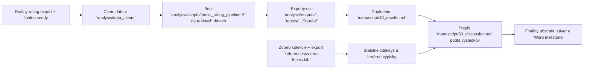

# Aktuálny stav diplomovky

> Posledná aktualizácia: 2026-03-29
> Tento súbor je operatívny dashboard. Má ukazovať reálny stav repa, nie želaný stav.

## Verdikt k dnešnému stavu

Práca nie je v počiatočnej fáze. Máš hotový výskumný rámec, silný draft úvodu a metódy a pripravenú analytickú kostru. Kritická cesta je teraz jasná: dotiahnuť literárny workflow v Zotere, dostať reálne rating dáta do `analysis/data_clean/`, spustiť pipeline na reálnych vstupoch a z toho doplniť výsledky, diskusiu, záver a finálny abstrakt.

## Stav repa po oblastiach

| Oblasť | Stav | Čo už je v repo | Čo chýba na ďalší posun |
| --- | --- | --- | --- |
| Rukopis | `rozpracované` | outline, názov/abstrakt, silný draft úvodu, silný draft metódy, kostra výsledkov, diskusný draft | finálne počty, výsledky z analýzy, doplnenie placeholderov, finálne prepojenie na Word |
| Literatúra | `čiastočne pripravené` | source map, import checklist, citekey seed workflow | chýba `references/zotero-thesis.bib`, chýbajú reálne výpisky v `notes/literature/` |
| Dáta a analýza | `skelet pripravený` | codebook, premenné, hypotézy, R pipeline, CSV šablóny | clean data v `analysis/data_clean/`, beh pipeline na reálnych dátach, exporty do `analysis/outputs/`, `tables/`, `figures/` |
| Operatívny tracking | `zavedené` | tento dashboard, backlog, aktualizačné pravidlá pre agentov | priebežná údržba po každej väčšej zmene |

## Stav kapitol IMRaD

| Súbor | Stav | Hodnotenie stavu | Najväčší blocker |
| --- | --- | --- | --- |
| `manuscript/10_title_abstract.md` | `rozpracované` | pracovný názov a použiteľný draft abstraktu už existujú | finálne výsledky pre abstrakt |
| `manuscript/20_introduction.md` | `silný draft` | logika IMRaD sedí, cieľ a hypotézy sú ukotvené, citekeys sú prevažne konkrétne | doplniť Zotero export a prípadné jemné štylistické doladenie |
| `manuscript/30_method.md` | `silný draft` | dizajn, premenné a analytický plán sú dobre pomenované | finálne počty raterov, finálny opis procedúry podľa reálneho zberu |
| `manuscript/40_results.md` | `kostra` | dobrá logika prezentácie, pripravené bloky podľa hypotéz | chýbajú reálne dáta, reliabilita, ICC, modely, tabuľky a grafy |
| `manuscript/50_discussion.md` | `polodraft` | interpretívna kostra a limity sú pripravené | treba ju prepísať podľa skutočných výsledkov, nie podľa hypotetických formulácií |
| `manuscript/60_conclusion.md` | `kostra` | záver má jasný rámec | potrebuje 3-5 finálnych viet po analýze |

## Kritická cesta

## Najdôležitejšie dependency a blokery

| Dependency | Stav | Blokuje | Poznámka |
| --- | --- | --- | --- |
| `references/zotero-thesis.bib` | `chýba` | finálnu kontrolu citekeys a Word workflow | source map je pripravený, ale export ešte nie je v repo |
| Výpisky v `notes/literature/` | `takmer prázdne` | rýchle prepisovanie intro/discussion | zatiaľ je tam len template |
| Clean ratings dataset | `chýba` | výsledky, tabuľky, grafy, záver | bez neho je `40_results.md` iba šablóna |
| Exporty v `tables/` a `figures/` | `chýbajú` | Word milestone a finálny Results | priečinky existujú, ale sú prázdne |
| Finálne počty raterov/ratingov | `chýbajú` | Method, Results, Abstract | placeholdery ostali v texte |

## Čo môžeš robiť hneď

- nastaviť Better BibTeX auto-export do `references/zotero-thesis.bib`
- vytvoriť 8-12 krátkych výpiskov pre jadro úvodu a diskusie v `notes/literature/`
- pripraviť clean export ratingov do `analysis/data_clean/`
- upravovať úvod a metódu štylisticky, lebo ich logika už stojí

## Čo zatiaľ neriešiť ako finálne

- finálny abstrakt
- finálny záver
- finálne znenie diskusie
- definitívne tabuľky a grafy do Wordu

Tieto časti sú závislé od reálnych analytických výstupov.
