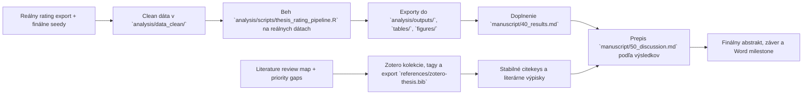

# Aktuálny stav diplomovky

> Posledná aktualizácia: 2026-04-07
> Tento súbor je operatívny dashboard. Má ukazovať reálny stav repa, nie želaný stav.

## Verdikt k dnešnému stavu

Práca nie je v počiatočnej fáze. Máš hotový výskumný rámec, revidovaný draft úvodu a metódy, vyčistenú kostru výsledkov, nový rozdelený literature bundle v `docs/literature/` a markdown knižnicu pomocných materiálov pre thesis writing v `docs/resources/thesis-writing-md/`. Kritická cesta je teraz jasnejšia: Zotero seed workflow je po importe a cleanup-e funkčný, `references/zotero-thesis.bib` už existuje, `references/bibliography-notes.md` má exact coverage `36 / 36`, nové jadro zdrojov je priradené do tematických subkolekcií, hlavná kolekcia je zosynchronizovaná tak, aby obsahovala aj položky, ktoré predtým existovali len v subkolekciách, thesis jadro má manuálnu vrstvu priorít a tematických tagov a dnešný fulltext audit ukazuje, že z `39` citekey-ready zdrojov má už `30` lokálne PDF a v `must-read` bloku zostávajú len `2` missing attachmenty. Evidence-anchored poznámkový korpus je rozšírený na `30` notes a z aktuálne PDF-ready core vetvy ostáva bez validovateľného note už len `cook2010computerizedvirtualpatients`, kde current attachment stále vyzerá byť supplement-only. Ďalší reálny posun je dorobiť tieto posledné missing full texty, potom doplniť výpisky pre nové jadro zdrojov, dostať reálne rating dáta do `analysis/data_clean/`, spustiť pipeline na reálnych vstupoch a z toho doplniť výsledky, diskusiu, záver a finálny abstrakt.

## Stav repa po oblastiach

| Oblasť | Stav | Čo už je v repo | Čo chýba na ďalší posun |
| --- | --- | --- | --- |
| Rukopis | `rozpracované` | outline, názov/abstrakt, revidovaný úvod, revidovaná metóda, vyčistená kostra výsledkov, diskusný draft | finálne počty, výsledky z analýzy, doplnenie placeholderov, finálne prepojenie na Word |
| Literatúra | `in_progress` | source map, import checklist, citekey seed workflow, rozdelený literature bundle s klastrami, gapmi, agent taskmi, plánom, `P1 expansion pass`, audit seed workflow v `docs/literature/bbt_seed_audit_2026-04-06.md`, importér `references/scripts/import_bibliography_notes_to_zotero.py`, cleanup script `references/scripts/cleanup_zotero_duplicates_and_enable_export.py`, export script `references/scripts/export_cleaned_collection_to_bib.py`, script na prvé roztriedenie do subkolekcií `references/scripts/assign_zotero_subcollections.py`, script na sync hlavnej kolekcie `references/scripts/sync_zotero_root_collection.py`, script na manuálne thesis tagy `references/scripts/assign_zotero_tags.py`, script na current audit attachmentov `references/scripts/report_zotero_fulltext_status.py`, finálny export `references/zotero-thesis.bib`, zosúladený `references/zotero-thesis-seed.bib`, prvý batch roztriedenia nových zdrojov do relevantných subkolekcií, sync hlavnej kolekcie so subkolekciami, manuálne priority + tematické tagy pre jadro citekey-ready zdrojov, dnešný fulltext checklist v `docs/literature/fulltext_checklist_2026-04-07.md`, 30 evidence-anchored výpiskov v `notes/literature/` a workflow pravidlá pre validovateľné notes zapísané v `AGENTS.md`, `docs/literature/README.md` a `references/zotero_import_checklist.md` | dorobiť posledné missing full texty pre `must-read` jadro, manuálne overiť `cook2010computerizedvirtualpatients` kvôli supplement-only attachmentu a potom ďalej rozširovať evidenčné výpisky |
| Dáta a analýza | `skelet pripravený` | codebook, premenné, hypotézy, R pipeline, CSV šablóny | clean data v `analysis/data_clean/`, beh pipeline na reálnych dátach, exporty do `analysis/outputs/`, `tables/`, `figures/` |
| Písacie podklady | `done` | konvertované materiály v `docs/resources/thesis-writing-md/`, syntetický README a nový brief `docs/guides/master-outline-diplomovky-v2.md` | používať ich pri draftingu, outline a auditovaní sekcií |
| Operatívny tracking | `zavedené` | tento dashboard, backlog, aktualizačné pravidlá pre agentov, workflow README pre literatúru | priebežná údržba po každej väčšej zmene |

## Stav kapitol IMRaD

| Súbor | Stav | Hodnotenie stavu | Najväčší blocker |
| --- | --- | --- | --- |
| `manuscript/10_title_abstract.md` | `rozpracované` | pracovný názov a použiteľný draft abstraktu už existujú | finálne výsledky pre abstrakt |
| `manuscript/20_introduction.md` | `silný draft` | logika IMRaD sedí, explicitné výskumné otázky a hypotézy sú ukotvené, pojmový rámec je čistejšie previazaný s outcome-mi | doplniť Zotero export a prípadné jemné štylistické doladenie |
| `manuscript/30_method.md` | `silný draft` | dizajn, premenné a analytický plán sú dobre pomenované a lepšie previazané s H1-H6 | finálne počty raterov, finálny opis procedúry podľa reálneho zberu |
| `manuscript/40_results.md` | `kostra` | logika prezentácie je čistejšia a lepšie drží poradie hypotéz a reportovacích pravidiel | chýbajú reálne dáta, reliabilita, ICC, modely, tabuľky a grafy |
| `manuscript/50_discussion.md` | `polodraft` | interpretívna kostra a limity sú pripravené | treba ju prepísať podľa skutočných výsledkov, nie podľa hypotetických formulácií |
| `manuscript/60_conclusion.md` | `kostra` | záver má jasný rámec | potrebuje 3-5 finálnych viet po analýze |

## Kritická cesta

## Najdôležitejšie dependency a blokery

| Dependency | Stav | Blokuje | Poznámka |
| --- | --- | --- | --- |
| `references/zotero-thesis.bib` | `done` | nič blokujúce | finálny cleaned export už reálne existuje v repo a sedí s current bibliography-notes workflow; hlavná Zotero kolekcia je zosynchronizovaná so subkolekciami a core zdroje majú manuálne thesis tagy |
| `references/zotero-thesis-seed.bib` | `done` | nič blokujúce | helper seed je zosúladený s finálnym exportom; `bibliography-notes` coverage je `36 / 36 exact` |
| Výpisky v `notes/literature/` | `in_progress` | rýchle prepisovanie intro/discussion | existuje už 30 evidence-anchored note súborov; workflow štandard je `opiera sa o + locator + väčší kontextový excerpt + parafráza + use`; z aktuálne PDF-ready core vetvy ostáva bez validovateľného note už len `cook2010computerizedvirtualpatients`, kde current Zotero attachment vyzerá byť len supplement; popri tom ešte treba dorobiť posledné missing full texty z `docs/literature/fulltext_checklist_2026-04-07.md` |
| Mapové literárne medzery A-D | `in_progress` | silnejšiu Method a Discussion | P1 expansion pass je už importnutý do Zotera, pretavený do čistého exportu a prvotne roztriedený do subkolekcií, ale ešte treba spraviť výpisky |
| Clean ratings dataset | `chýba` | výsledky, tabuľky, grafy, záver | bez neho je `40_results.md` iba šablóna |
| Exporty v `tables/` a `figures/` | `chýbajú` | Word milestone a finálny Results | priečinky existujú, ale sú prázdne |
| Finálne počty raterov/ratingov | `chýbajú` | Method, Results, Abstract | placeholdery ostali v texte |

## Čo môžeš robiť hneď

- dorobiť posledné missing full texty pre `must-read` blok podľa `docs/literature/fulltext_checklist_2026-04-07.md`
- manuálne overiť `cook2010computerizedvirtualpatients` a doplniť hlavný fulltext, ak current attachment ostáva supplement-only
- rozšíriť výpisky zo súčasných 30 evidence-anchored notes na celé must-read jadro a 4 literárne gaps v `notes/literature/`
- jemne doladiť priority/tagy a prípadné sekundárne subkolekcie pre širší thesis corpus
- pripraviť clean export ratingov do `analysis/data_clean/`
- doplniť finálne počty raterov a ratingov do `manuscript/30_method.md` a `manuscript/40_results.md`
- pri ďalšom draftingu používať aj `docs/guides/master-outline-diplomovky-v2.md`, nie len starší sprievodca a outline
- upravovať úvod a metódu štylisticky, lebo ich logika už stojí

## Čo zatiaľ neriešiť ako finálne

- finálny abstrakt
- finálny záver
- finálne znenie diskusie
- definitívne tabuľky a grafy do Wordu

Tieto časti sú závislé od reálnych analytických výstupov.
