# K-Means navod SPSS

Metóda K-Means je štatistická metóda, prostredníctvom ktorej zoskupujeme participantov do skupín (klastrov, zhlukov, typov) na základe ich podobnosti a rozdielnosti. Cieľom je nájsť optimálne riešenie – t.j. aby participanti boli vo vnútri zhluku čo najpodobnejší a aby sa zároveň nepodobali na participantov z iných zhlukov. Cieľom je teda rozdeliť participantov do klastrov tak, aby vzdialenosť medzi všetkými objektmi a ich centrami bola minimalizovaná.

Metóda K-Means je nehierarchická metóda – všetky vytvorené typy sú „na jednej“ úrovni. Jedná sa o heuristickú metódu. To znamená, že počet typov zadávame vopred my a hľadáme optimálne riešenie (systém nám nepovie, či máme zvoliť trojtypové alebo štvortypové riešenie – vzniknuté typy totiž interpretujeme z pohľadu psychológie).

Princíp metódy: Systém náhodne vyberie centrá klastrov a každý objekt priradí k zhluku, ktorého centrum je k nemu najbližšie (jedná sa o tzv. centroid - vektor, ktorého hodnoty sú aritmetickými priemermi hodnôt všetkých objektov zhluku). Po priradení všetkých objektov sa centrá prepočítavajú (opäť na princípe priemerov, preto sa metóda volá K-Means). Tento algoritmus sa opakuje, kým nie je nájdené optimálne riešenie (t.j. centrá sa už nemenia – najpodobnejší participanti sú zoskupení v jednom type). Analýza je tiež zastavená, ak v systéme vopred zvolíme určitý počet tzv. iterácií, čie prepočítavaní.

Nevýhoda metódy – metóda pracuje na princípe prepočítavania aritmetického priemeru – t.j. výpočet je skreslený, ak sú v súbore vybočujúce alebo extrémne hodnoty alebo ak je distribúcia negaussovská. Metóda je citlivá na jednotky merania – keďže metódy, s ktorými pracujeme, majú rôzne jednotky a rôzne teoretické rozpätia, je potrebné zrealizovať prevod hrubého skóre na štandardizované skóre – Z-skóre (prichádzame tým o určitú presnosť dát).

Práca s programom SPSS:

Transformácia skóre na Z skóre - Analyze – Descriptive Statistic – Descriptives

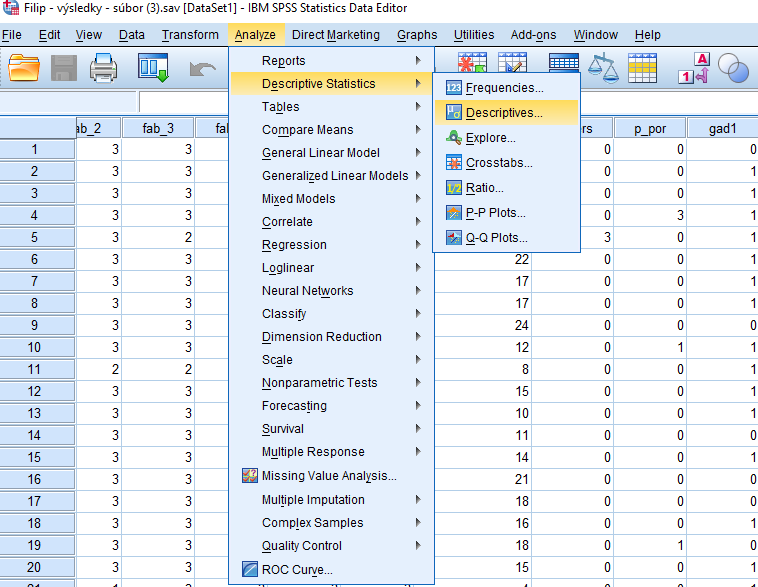

V dialógovom boxe presunieme na pravú stranu najdôležitejšie ukazovatele v jednotlivých doménach a v dolnej časti zaškrtneme políčko Save standardized values as variables – po spustení príkazu sa v dátovom súbore vytvoria nové stĺpce, s ktorými budeme pracovať.

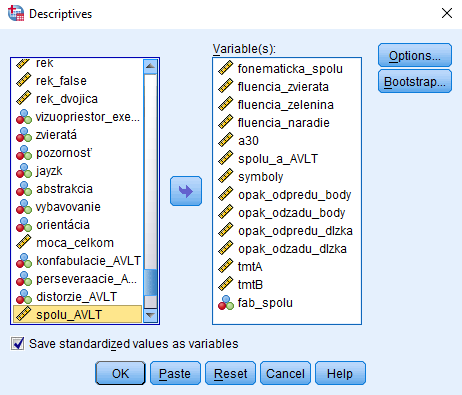

Metódu K- Means nájdeme v ponuke Analyze – Classify – K-Means Cluster

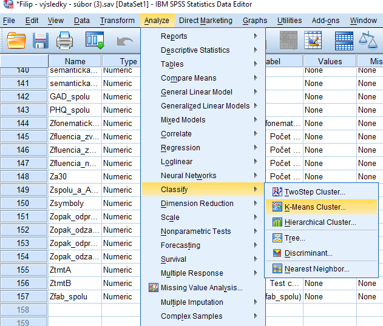

V dialógovom boxe presunieme na pravú stranu všetky novo vytvorené premenné (Z skóre) a nastavíme počet zhlukov. V prvom prípade 3.

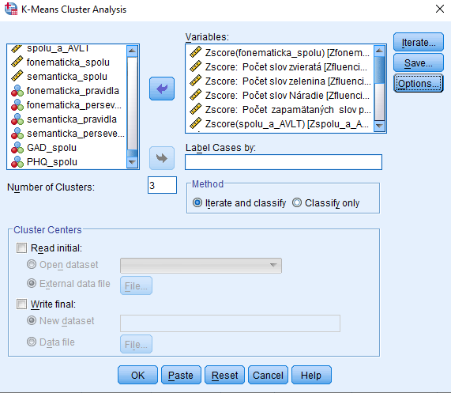

Stlačíme rádiové tlačidlo Save a zvolíme možnosť Cluster membership – opäť sa nám vytvorí nová premenná – Typológia, ktorá bude mať varianty jednotlivé typy – v práci s premennou môžete ďalej pracovať

Kliknutím na rádiové tlačidlo Options otvoríme nové okno, v ktorom zaškrtneme možnosť ANOVA table (zisťujeme štatistickú odlíšiteľnosť typov) a môžeme aj Cluster information for each case – uvidíme zaradenie jednotlivých participantov do typov

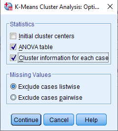

Výsledky

Trojtypové riešenie

Zaujíma nás „profil“ jednotlivých typov – t.j. hodnoty centier definitívnych klastrov

<table style="width:73%;">
<colgroup>
<col style="width: 47%" />
<col style="width: 8%" />
<col style="width: 9%" />
<col style="width: 8%" />
</colgroup>
<tbody>
<tr>
<td colspan="4" style="text-align: center;"><blockquote>

<strong>Final Cluster Centers</strong>

</blockquote></td>
</tr>
<tr>
<td rowspan="2" style="text-align: center;"></td>
<td colspan="3" style="text-align: center;"><blockquote>

Cluster

</blockquote></td>
</tr>
<tr>
<td style="text-align: center;"><blockquote>

1

</blockquote></td>
<td style="text-align: center;"><blockquote>

2

</blockquote></td>
<td style="text-align: center;"><blockquote>

3

</blockquote></td>
</tr>
<tr>
<td style="text-align: center;"><blockquote>

Zscore(fonematicka_spolu)

</blockquote></td>
<td style="text-align: right;"><blockquote>

,65132

</blockquote></td>
<td style="text-align: right;"><blockquote>

-1,17756

</blockquote></td>
<td style="text-align: right;"><blockquote>

,07163

</blockquote></td>
</tr>
<tr>
<td style="text-align: center;"><blockquote>

Zscore: Počet slov zvieratá

</blockquote></td>
<td style="text-align: right;"><blockquote>

-,03926

</blockquote></td>
<td style="text-align: right;"><blockquote>

-1,10773

</blockquote></td>
<td style="text-align: right;"><blockquote>

,41665

</blockquote></td>
</tr>
<tr>
<td style="text-align: center;"><blockquote>

Zscore: Počet slov zelenina

</blockquote></td>
<td style="text-align: right;"><blockquote>

,54212

</blockquote></td>
<td style="text-align: right;"><blockquote>

-1,18570

</blockquote></td>
<td style="text-align: right;"><blockquote>

,13304

</blockquote></td>
</tr>
<tr>
<td style="text-align: center;"><blockquote>

Zscore: Počet slov Náradie

</blockquote></td>
<td style="text-align: right;"><blockquote>

,00632

</blockquote></td>
<td style="text-align: right;"><blockquote>

-1,06052

</blockquote></td>
<td style="text-align: right;"><blockquote>

,37537

</blockquote></td>
</tr>
<tr>
<td style="text-align: center;"><blockquote>

Zscore: Počet zapamätaných slov po 30 minútach

</blockquote></td>
<td style="text-align: right;"><blockquote>

,26915

</blockquote></td>
<td style="text-align: right;"><blockquote>

-1,11381

</blockquote></td>
<td style="text-align: right;"><blockquote>

,25360

</blockquote></td>
</tr>
<tr>
<td style="text-align: center;"><blockquote>

Zscore(spolu_a_AVLT)

</blockquote></td>
<td style="text-align: right;"><blockquote>

,55571

</blockquote></td>
<td style="text-align: right;"><blockquote>

-1,01209

</blockquote></td>
<td style="text-align: right;"><blockquote>

,06376

</blockquote></td>
</tr>
<tr>
<td style="text-align: center;"><blockquote>

Zscore: Kódovanie symbolov výsledné skóre

</blockquote></td>
<td style="text-align: right;"><blockquote>

,59648

</blockquote></td>
<td style="text-align: right;"><blockquote>

-,91460

</blockquote></td>
<td style="text-align: right;"><blockquote>

,00710

</blockquote></td>
</tr>
<tr>
<td style="text-align: center;"><blockquote>

Zscore: Počet správnych odpovedí odpredu

</blockquote></td>
<td style="text-align: right;"><blockquote>

,86416

</blockquote></td>
<td style="text-align: right;"><blockquote>

-,83069

</blockquote></td>
<td style="text-align: right;"><blockquote>

-,16627

</blockquote></td>
</tr>
<tr>
<td style="text-align: center;"><blockquote>

Zscore: Počet správnych odpovedí odzadu

</blockquote></td>
<td style="text-align: right;"><blockquote>

1,16418

</blockquote></td>
<td style="text-align: right;"><blockquote>

-,52095

</blockquote></td>
<td style="text-align: right;"><blockquote>

-,43761

</blockquote></td>
</tr>
<tr>
<td style="text-align: center;"><blockquote>

Zscore: Najdlhší číselný rad odpredu

</blockquote></td>
<td style="text-align: right;"><blockquote>

,78313

</blockquote></td>
<td style="text-align: right;"><blockquote>

-,79784

</blockquote></td>
<td style="text-align: right;"><blockquote>

-,13459

</blockquote></td>
</tr>
<tr>
<td style="text-align: center;"><blockquote>

Zscore: Najdlhší číselný rad odzadu

</blockquote></td>
<td style="text-align: right;"><blockquote>

1,24599

</blockquote></td>
<td style="text-align: right;"><blockquote>

-,52473

</blockquote></td>
<td style="text-align: right;"><blockquote>

-,48009

</blockquote></td>
</tr>
<tr>
<td style="text-align: center;"><blockquote>

Zscore: Test cesty A - celkový čas

</blockquote></td>
<td style="text-align: right;"><blockquote>

-,49167

</blockquote></td>
<td style="text-align: right;"><blockquote>

,85018

</blockquote></td>
<td style="text-align: right;"><blockquote>

-,04024

</blockquote></td>
</tr>
<tr>
<td style="text-align: center;"><blockquote>

Zscore: Test cesty B - celkový čas

</blockquote></td>
<td style="text-align: right;"><blockquote>

-,61303

</blockquote></td>
<td style="text-align: right;"><blockquote>

,84185

</blockquote></td>
<td style="text-align: right;"><blockquote>

,02775

</blockquote></td>
</tr>
<tr>
<td style="text-align: center;"><blockquote>

Zscore(fab_spolu)

</blockquote></td>
<td style="text-align: right;"><blockquote>

,55295

</blockquote></td>
<td style="text-align: right;"><blockquote>

-,65378

</blockquote></td>
<td style="text-align: right;"><blockquote>

-,06273

</blockquote></td>
</tr>
</tbody>
</table>

Znázornenie týchto hodnôt v grafe – graf vytvoríme tak, že vo výstupe v SPSS v predchádzajúcej tabuľke s jednotlivými Z-skóre označíme na čierno hodnoty, akoby sme ich išli skopírovať a pravým tlačidlom myši klikneme na označenú časť. V ponuke zvolíme Create Graph a Bar.

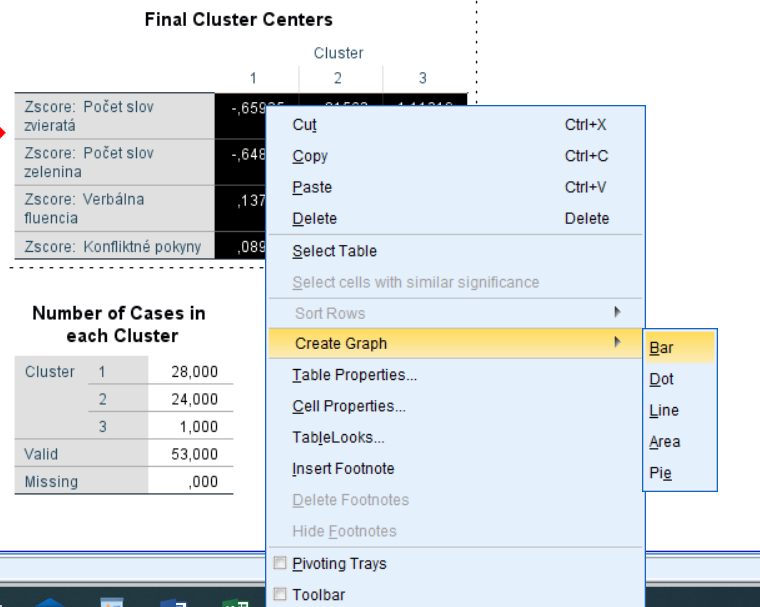

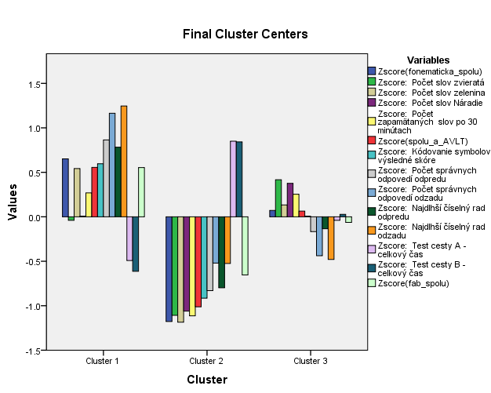

Štatistická odlíšiteľnosť jednotlivých typov z hľadiska skúmaných premenných (stĺpec Sig)

<table>
<colgroup>
<col style="width: 26%" />
<col style="width: 15%" />
<col style="width: 10%" />
<col style="width: 15%" />
<col style="width: 10%" />
<col style="width: 10%" />
<col style="width: 10%" />
</colgroup>
<tbody>
<tr>
<td colspan="7" style="text-align: center;"><blockquote>

<strong>ANOVA</strong>

</blockquote></td>
</tr>
<tr>
<td rowspan="2" style="text-align: center;"></td>
<td colspan="2" style="text-align: center;"><blockquote>

Cluster

</blockquote></td>
<td colspan="2" style="text-align: center;"><blockquote>

Error

</blockquote></td>
<td rowspan="2" style="text-align: center;"><blockquote>

F

</blockquote></td>
<td rowspan="2" style="text-align: center;"><blockquote>

Sig.

</blockquote></td>
</tr>
<tr>
<td style="text-align: center;"><blockquote>

Mean Square

</blockquote></td>
<td style="text-align: center;"><blockquote>

df

</blockquote></td>
<td style="text-align: center;"><blockquote>

Mean Square

</blockquote></td>
<td style="text-align: center;"><blockquote>

df

</blockquote></td>
</tr>
<tr>
<td style="text-align: center;"><blockquote>

Zscore(fonematicka_spolu)

</blockquote></td>
<td style="text-align: right;"><blockquote>

10,187

</blockquote></td>
<td style="text-align: right;"><blockquote>

2

</blockquote></td>
<td style="text-align: right;"><blockquote>

,633

</blockquote></td>
<td style="text-align: right;"><blockquote>

50

</blockquote></td>
<td style="text-align: right;"><blockquote>

16,105

</blockquote></td>
<td style="text-align: right;"><blockquote>

,000

</blockquote></td>
</tr>
<tr>
<td style="text-align: center;"><blockquote>

Zscore: Počet slov zvieratá

</blockquote></td>
<td style="text-align: right;"><blockquote>

8,577

</blockquote></td>
<td style="text-align: right;"><blockquote>

2

</blockquote></td>
<td style="text-align: right;"><blockquote>

,697

</blockquote></td>
<td style="text-align: right;"><blockquote>

50

</blockquote></td>
<td style="text-align: right;"><blockquote>

12,307

</blockquote></td>
<td style="text-align: right;"><blockquote>

,000

</blockquote></td>
</tr>
<tr>
<td style="text-align: center;"><blockquote>

Zscore: Počet slov zelenina

</blockquote></td>
<td style="text-align: right;"><blockquote>

9,481

</blockquote></td>
<td style="text-align: right;"><blockquote>

2

</blockquote></td>
<td style="text-align: right;"><blockquote>

,661

</blockquote></td>
<td style="text-align: right;"><blockquote>

50

</blockquote></td>
<td style="text-align: right;"><blockquote>

14,349

</blockquote></td>
<td style="text-align: right;"><blockquote>

,000

</blockquote></td>
</tr>
<tr>
<td style="text-align: center;"><blockquote>

Zscore: Počet slov Náradie

</blockquote></td>
<td style="text-align: right;"><blockquote>

7,596

</blockquote></td>
<td style="text-align: right;"><blockquote>

2

</blockquote></td>
<td style="text-align: right;"><blockquote>

,736

</blockquote></td>
<td style="text-align: right;"><blockquote>

50

</blockquote></td>
<td style="text-align: right;"><blockquote>

10,319

</blockquote></td>
<td style="text-align: right;"><blockquote>

,000

</blockquote></td>
</tr>
<tr>
<td style="text-align: center;"><blockquote>

Zscore: Počet zapamätaných slov po 30 minútach

</blockquote></td>
<td style="text-align: right;"><blockquote>

7,647

</blockquote></td>
<td style="text-align: right;"><blockquote>

2

</blockquote></td>
<td style="text-align: right;"><blockquote>

,734

</blockquote></td>
<td style="text-align: right;"><blockquote>

50

</blockquote></td>
<td style="text-align: right;"><blockquote>

10,416

</blockquote></td>
<td style="text-align: right;"><blockquote>

,000

</blockquote></td>
</tr>
<tr>
<td style="text-align: center;"><blockquote>

Zscore(spolu_a_AVLT)

</blockquote></td>
<td style="text-align: right;"><blockquote>

7,495

</blockquote></td>
<td style="text-align: right;"><blockquote>

2

</blockquote></td>
<td style="text-align: right;"><blockquote>

,740

</blockquote></td>
<td style="text-align: right;"><blockquote>

50

</blockquote></td>
<td style="text-align: right;"><blockquote>

10,125

</blockquote></td>
<td style="text-align: right;"><blockquote>

,000

</blockquote></td>
</tr>
<tr>
<td style="text-align: center;"><blockquote>

Zscore: Kódovanie symbolov výsledné skóre

</blockquote></td>
<td style="text-align: right;"><blockquote>

6,852

</blockquote></td>
<td style="text-align: right;"><blockquote>

2

</blockquote></td>
<td style="text-align: right;"><blockquote>

,766

</blockquote></td>
<td style="text-align: right;"><blockquote>

50

</blockquote></td>
<td style="text-align: right;"><blockquote>

8,945

</blockquote></td>
<td style="text-align: right;"><blockquote>

,000

</blockquote></td>
</tr>
<tr>
<td style="text-align: center;"><blockquote>

Zscore: Počet správnych odpovedí odpredu

</blockquote></td>
<td style="text-align: right;"><blockquote>

9,438

</blockquote></td>
<td style="text-align: right;"><blockquote>

2

</blockquote></td>
<td style="text-align: right;"><blockquote>

,662

</blockquote></td>
<td style="text-align: right;"><blockquote>

50

</blockquote></td>
<td style="text-align: right;"><blockquote>

14,247

</blockquote></td>
<td style="text-align: right;"><blockquote>

,000

</blockquote></td>
</tr>
<tr>
<td style="text-align: center;"><blockquote>

Zscore: Počet správnych odpovedí odzadu

</blockquote></td>
<td style="text-align: right;"><blockquote>

14,203

</blockquote></td>
<td style="text-align: right;"><blockquote>

2

</blockquote></td>
<td style="text-align: right;"><blockquote>

,472

</blockquote></td>
<td style="text-align: right;"><blockquote>

50

</blockquote></td>
<td style="text-align: right;"><blockquote>

30,098

</blockquote></td>
<td style="text-align: right;"><blockquote>

,000

</blockquote></td>
</tr>
<tr>
<td style="text-align: center;"><blockquote>

Zscore: Najdlhší číselný rad odpredu

</blockquote></td>
<td style="text-align: right;"><blockquote>

8,036

</blockquote></td>
<td style="text-align: right;"><blockquote>

2

</blockquote></td>
<td style="text-align: right;"><blockquote>

,719

</blockquote></td>
<td style="text-align: right;"><blockquote>

50

</blockquote></td>
<td style="text-align: right;"><blockquote>

11,184

</blockquote></td>
<td style="text-align: right;"><blockquote>

,000

</blockquote></td>
</tr>
<tr>
<td style="text-align: center;"><blockquote>

Zscore: Najdlhší číselný rad odzadu

</blockquote></td>
<td style="text-align: right;"><blockquote>

16,247

</blockquote></td>
<td style="text-align: right;"><blockquote>

2

</blockquote></td>
<td style="text-align: right;"><blockquote>

,390

</blockquote></td>
<td style="text-align: right;"><blockquote>

50

</blockquote></td>
<td style="text-align: right;"><blockquote>

41,648

</blockquote></td>
<td style="text-align: right;"><blockquote>

,000

</blockquote></td>
</tr>
<tr>
<td style="text-align: center;"><blockquote>

Zscore: Test cesty A - celkový čas

</blockquote></td>
<td style="text-align: right;"><blockquote>

5,450

</blockquote></td>
<td style="text-align: right;"><blockquote>

2

</blockquote></td>
<td style="text-align: right;"><blockquote>

,822

</blockquote></td>
<td style="text-align: right;"><blockquote>

50

</blockquote></td>
<td style="text-align: right;"><blockquote>

6,630

</blockquote></td>
<td style="text-align: right;"><blockquote>

,003

</blockquote></td>
</tr>
<tr>
<td style="text-align: center;"><blockquote>

Zscore: Test cesty B - celkový čas

</blockquote></td>
<td style="text-align: right;"><blockquote>

6,373

</blockquote></td>
<td style="text-align: right;"><blockquote>

2

</blockquote></td>
<td style="text-align: right;"><blockquote>

,785

</blockquote></td>
<td style="text-align: right;"><blockquote>

50

</blockquote></td>
<td style="text-align: right;"><blockquote>

8,117

</blockquote></td>
<td style="text-align: right;"><blockquote>

,001

</blockquote></td>
</tr>
<tr>
<td style="text-align: center;"><blockquote>

Zscore(fab_spolu)

</blockquote></td>
<td style="text-align: right;"><blockquote>

4,485

</blockquote></td>
<td style="text-align: right;"><blockquote>

2

</blockquote></td>
<td style="text-align: right;"><blockquote>

,861

</blockquote></td>
<td style="text-align: right;"><blockquote>

50

</blockquote></td>
<td style="text-align: right;"><blockquote>

5,212

</blockquote></td>
<td style="text-align: right;"><blockquote>

,009

</blockquote></td>
</tr>
</tbody>
</table>

Počet participantov v jednotlivých typoch

<table style="width:30%;">
<colgroup>
<col style="width: 9%" />
<col style="width: 8%" />
<col style="width: 11%" />
</colgroup>
<tbody>
<tr>
<td colspan="3" style="text-align: center;"><blockquote>

<strong>Number of Cases in each Cluster</strong>

</blockquote></td>
</tr>
<tr>
<td rowspan="3" style="text-align: center;"><blockquote>

Cluster

</blockquote></td>
<td style="text-align: center;"><blockquote>

1

</blockquote></td>
<td style="text-align: right;"><blockquote>

15,000

</blockquote></td>
</tr>
<tr>
<td style="text-align: center;"><blockquote>

2

</blockquote></td>
<td style="text-align: right;"><blockquote>

10,000

</blockquote></td>
</tr>
<tr>
<td style="text-align: center;"><blockquote>

3

</blockquote></td>
<td style="text-align: right;"><blockquote>

28,000

</blockquote></td>
</tr>
<tr>
<td colspan="2" style="text-align: center;"><blockquote>

Valid

</blockquote></td>
<td style="text-align: right;"><blockquote>

53,000

</blockquote></td>
</tr>
<tr>
<td colspan="2" style="text-align: center;"><blockquote>

Missing

</blockquote></td>
<td style="text-align: right;"><blockquote>

,000

</blockquote></td>
</tr>
</tbody>
</table>

Postup opakujeme s iným počtom klastrov

Štvortypové riešenie

<table style="width:71%;">
<colgroup>
<col style="width: 26%" />
<col style="width: 11%" />
<col style="width: 11%" />
<col style="width: 11%" />
<col style="width: 11%" />
</colgroup>
<tbody>
<tr>
<td colspan="5" style="text-align: center;"><blockquote>

<strong>Final Cluster Centers</strong>

</blockquote></td>
</tr>
<tr>
<td rowspan="2" style="text-align: center;"></td>
<td colspan="4" style="text-align: center;"><blockquote>

Cluster

</blockquote></td>
</tr>
<tr>
<td style="text-align: center;"><blockquote>

1

</blockquote></td>
<td style="text-align: center;"><blockquote>

2

</blockquote></td>
<td style="text-align: center;"><blockquote>

3

</blockquote></td>
<td style="text-align: center;"><blockquote>

4

</blockquote></td>
</tr>
<tr>
<td style="text-align: center;"><blockquote>

Zscore(fonematicka_spolu)

</blockquote></td>
<td style="text-align: right;"><blockquote>

,67801

</blockquote></td>
<td style="text-align: right;"><blockquote>

-,52442

</blockquote></td>
<td style="text-align: right;"><blockquote>

,81442

</blockquote></td>
<td style="text-align: right;"><blockquote>

-1,54557

</blockquote></td>
</tr>
<tr>
<td style="text-align: center;"><blockquote>

Zscore: Počet slov zvieratá

</blockquote></td>
<td style="text-align: right;"><blockquote>

,10936

</blockquote></td>
<td style="text-align: right;"><blockquote>

-,04948

</blockquote></td>
<td style="text-align: right;"><blockquote>

,56527

</blockquote></td>
<td style="text-align: right;"><blockquote>

-1,44514

</blockquote></td>
</tr>
<tr>
<td style="text-align: center;"><blockquote>

Zscore: Počet slov zelenina

</blockquote></td>
<td style="text-align: right;"><blockquote>

,59065

</blockquote></td>
<td style="text-align: right;"><blockquote>

-,33591

</blockquote></td>
<td style="text-align: right;"><blockquote>

,32371

</blockquote></td>
<td style="text-align: right;"><blockquote>

-,95273

</blockquote></td>
</tr>
<tr>
<td style="text-align: center;"><blockquote>

Zscore: Počet slov Náradie

</blockquote></td>
<td style="text-align: right;"><blockquote>

,12976

</blockquote></td>
<td style="text-align: right;"><blockquote>

-,26700

</blockquote></td>
<td style="text-align: right;"><blockquote>

,81306

</blockquote></td>
<td style="text-align: right;"><blockquote>

-1,13987

</blockquote></td>
</tr>
<tr>
<td style="text-align: center;"><blockquote>

Zscore: Počet zapamätaných slov po 30 minútach

</blockquote></td>
<td style="text-align: right;"><blockquote>

,27693

</blockquote></td>
<td style="text-align: right;"><blockquote>

-,25552

</blockquote></td>
<td style="text-align: right;"><blockquote>

,67751

</blockquote></td>
<td style="text-align: right;"><blockquote>

-1,27715

</blockquote></td>
</tr>
<tr>
<td style="text-align: center;"><blockquote>

Zscore(spolu_a_AVLT)

</blockquote></td>
<td style="text-align: right;"><blockquote>

,48667

</blockquote></td>
<td style="text-align: right;"><blockquote>

-,17806

</blockquote></td>
<td style="text-align: right;"><blockquote>

,38786

</blockquote></td>
<td style="text-align: right;"><blockquote>

-1,51009

</blockquote></td>
</tr>
<tr>
<td style="text-align: center;"><blockquote>

Zscore: Kódovanie symbolov výsledné skóre

</blockquote></td>
<td style="text-align: right;"><blockquote>

,59024

</blockquote></td>
<td style="text-align: right;"><blockquote>

,16704

</blockquote></td>
<td style="text-align: right;"><blockquote>

-,44727

</blockquote></td>
<td style="text-align: right;"><blockquote>

-1,31419

</blockquote></td>
</tr>
<tr>
<td style="text-align: center;"><blockquote>

Zscore: Počet správnych odpovedí odpredu

</blockquote></td>
<td style="text-align: right;"><blockquote>

,98803

</blockquote></td>
<td style="text-align: right;"><blockquote>

-,65512

</blockquote></td>
<td style="text-align: right;"><blockquote>

,31235

</blockquote></td>
<td style="text-align: right;"><blockquote>

-,63362

</blockquote></td>
</tr>
<tr>
<td style="text-align: center;"><blockquote>

Zscore: Počet správnych odpovedí odzadu

</blockquote></td>
<td style="text-align: right;"><blockquote>

1,21356

</blockquote></td>
<td style="text-align: right;"><blockquote>

-,35204

</blockquote></td>
<td style="text-align: right;"><blockquote>

-,67938

</blockquote></td>
<td style="text-align: right;"><blockquote>

-,21849

</blockquote></td>
</tr>
<tr>
<td style="text-align: center;"><blockquote>

Zscore: Najdlhší číselný rad odpredu

</blockquote></td>
<td style="text-align: right;"><blockquote>

,89129

</blockquote></td>
<td style="text-align: right;"><blockquote>

-,63994

</blockquote></td>
<td style="text-align: right;"><blockquote>

,43799

</blockquote></td>
<td style="text-align: right;"><blockquote>

-,73103

</blockquote></td>
</tr>
<tr>
<td style="text-align: center;"><blockquote>

Zscore: Najdlhší číselný rad odzadu

</blockquote></td>
<td style="text-align: right;"><blockquote>

1,24971

</blockquote></td>
<td style="text-align: right;"><blockquote>

-,40400

</blockquote></td>
<td style="text-align: right;"><blockquote>

-,62889

</blockquote></td>
<td style="text-align: right;"><blockquote>

-,21225

</blockquote></td>
</tr>
<tr>
<td style="text-align: center;"><blockquote>

Zscore: Test cesty A - celkový čas

</blockquote></td>
<td style="text-align: right;"><blockquote>

-,46049

</blockquote></td>
<td style="text-align: right;"><blockquote>

-,03938

</blockquote></td>
<td style="text-align: right;"><blockquote>

-,00654

</blockquote></td>
<td style="text-align: right;"><blockquote>

1,47834

</blockquote></td>
</tr>
<tr>
<td style="text-align: center;"><blockquote>

Zscore: Test cesty B - celkový čas

</blockquote></td>
<td style="text-align: right;"><blockquote>

-,64722

</blockquote></td>
<td style="text-align: right;"><blockquote>

-,17728

</blockquote></td>
<td style="text-align: right;"><blockquote>

,29932

</blockquote></td>
<td style="text-align: right;"><blockquote>

1,87389

</blockquote></td>
</tr>
<tr>
<td style="text-align: center;"><blockquote>

Zscore(fab_spolu)

</blockquote></td>
<td style="text-align: right;"><blockquote>

,57534

</blockquote></td>
<td style="text-align: right;"><blockquote>

,08992

</blockquote></td>
<td style="text-align: right;"><blockquote>

-,38736

</blockquote></td>
<td style="text-align: right;"><blockquote>

-1,07692

</blockquote></td>
</tr>
</tbody>
</table>

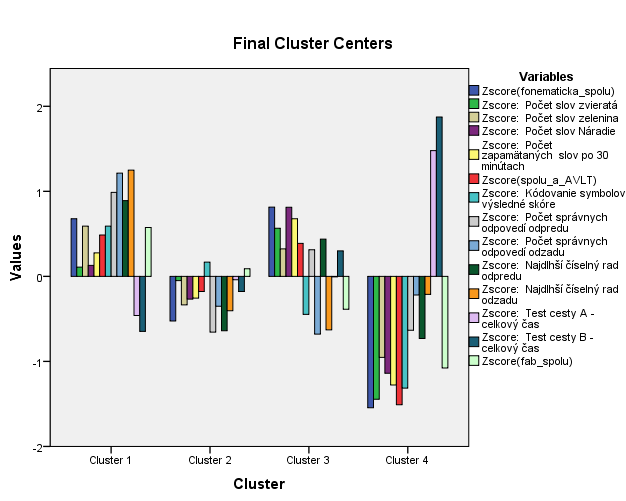

<table>
<colgroup>
<col style="width: 26%" />
<col style="width: 15%" />
<col style="width: 10%" />
<col style="width: 15%" />
<col style="width: 10%" />
<col style="width: 10%" />
<col style="width: 10%" />
</colgroup>
<tbody>
<tr>
<td colspan="7" style="text-align: center;"><blockquote>

<strong>ANOVA</strong>

</blockquote></td>
</tr>
<tr>
<td rowspan="2" style="text-align: center;"></td>
<td colspan="2" style="text-align: center;"><blockquote>

Cluster

</blockquote></td>
<td colspan="2" style="text-align: center;"><blockquote>

Error

</blockquote></td>
<td rowspan="2" style="text-align: center;"><blockquote>

F

</blockquote></td>
<td rowspan="2" style="text-align: center;"><blockquote>

Sig.

</blockquote></td>
</tr>
<tr>
<td style="text-align: center;"><blockquote>

Mean Square

</blockquote></td>
<td style="text-align: center;"><blockquote>

df

</blockquote></td>
<td style="text-align: center;"><blockquote>

Mean Square

</blockquote></td>
<td style="text-align: center;"><blockquote>

df

</blockquote></td>
</tr>
<tr>
<td style="text-align: center;"><blockquote>

Zscore(fonematicka_spolu)

</blockquote></td>
<td style="text-align: right;"><blockquote>

10,796

</blockquote></td>
<td style="text-align: right;"><blockquote>

3

</blockquote></td>
<td style="text-align: right;"><blockquote>

,400

</blockquote></td>
<td style="text-align: right;"><blockquote>

49

</blockquote></td>
<td style="text-align: right;"><blockquote>

26,977

</blockquote></td>
<td style="text-align: right;"><blockquote>

,000

</blockquote></td>
</tr>
<tr>
<td style="text-align: center;"><blockquote>

Zscore: Počet slov zvieratá

</blockquote></td>
<td style="text-align: right;"><blockquote>

4,833

</blockquote></td>
<td style="text-align: right;"><blockquote>

3

</blockquote></td>
<td style="text-align: right;"><blockquote>

,765

</blockquote></td>
<td style="text-align: right;"><blockquote>

49

</blockquote></td>
<td style="text-align: right;"><blockquote>

6,314

</blockquote></td>
<td style="text-align: right;"><blockquote>

,001

</blockquote></td>
</tr>
<tr>
<td style="text-align: center;"><blockquote>

Zscore: Počet slov zelenina

</blockquote></td>
<td style="text-align: right;"><blockquote>

4,387

</blockquote></td>
<td style="text-align: right;"><blockquote>

3

</blockquote></td>
<td style="text-align: right;"><blockquote>

,793

</blockquote></td>
<td style="text-align: right;"><blockquote>

49

</blockquote></td>
<td style="text-align: right;"><blockquote>

5,536

</blockquote></td>
<td style="text-align: right;"><blockquote>

,002

</blockquote></td>
</tr>
<tr>
<td style="text-align: center;"><blockquote>

Zscore: Počet slov Náradie

</blockquote></td>
<td style="text-align: right;"><blockquote>

5,411

</blockquote></td>
<td style="text-align: right;"><blockquote>

3

</blockquote></td>
<td style="text-align: right;"><blockquote>

,730

</blockquote></td>
<td style="text-align: right;"><blockquote>

49

</blockquote></td>
<td style="text-align: right;"><blockquote>

7,413

</blockquote></td>
<td style="text-align: right;"><blockquote>

,000

</blockquote></td>
</tr>
<tr>
<td style="text-align: center;"><blockquote>

Zscore: Počet zapamätaných slov po 30 minútach

</blockquote></td>
<td style="text-align: right;"><blockquote>

5,391

</blockquote></td>
<td style="text-align: right;"><blockquote>

3

</blockquote></td>
<td style="text-align: right;"><blockquote>

,731

</blockquote></td>
<td style="text-align: right;"><blockquote>

49

</blockquote></td>
<td style="text-align: right;"><blockquote>

7,374

</blockquote></td>
<td style="text-align: right;"><blockquote>

,000

</blockquote></td>
</tr>
<tr>
<td style="text-align: center;"><blockquote>

Zscore(spolu_a_AVLT)

</blockquote></td>
<td style="text-align: right;"><blockquote>

5,740

</blockquote></td>
<td style="text-align: right;"><blockquote>

3

</blockquote></td>
<td style="text-align: right;"><blockquote>

,710

</blockquote></td>
<td style="text-align: right;"><blockquote>

49

</blockquote></td>
<td style="text-align: right;"><blockquote>

8,087

</blockquote></td>
<td style="text-align: right;"><blockquote>

,000

</blockquote></td>
</tr>
<tr>
<td style="text-align: center;"><blockquote>

Zscore: Kódovanie symbolov výsledné skóre

</blockquote></td>
<td style="text-align: right;"><blockquote>

5,509

</blockquote></td>
<td style="text-align: right;"><blockquote>

3

</blockquote></td>
<td style="text-align: right;"><blockquote>

,724

</blockquote></td>
<td style="text-align: right;"><blockquote>

49

</blockquote></td>
<td style="text-align: right;"><blockquote>

7,610

</blockquote></td>
<td style="text-align: right;"><blockquote>

,000

</blockquote></td>
</tr>
<tr>
<td style="text-align: center;"><blockquote>

Zscore: Počet správnych odpovedí odpredu

</blockquote></td>
<td style="text-align: right;"><blockquote>

8,762

</blockquote></td>
<td style="text-align: right;"><blockquote>

3

</blockquote></td>
<td style="text-align: right;"><blockquote>

,525

</blockquote></td>
<td style="text-align: right;"><blockquote>

49

</blockquote></td>
<td style="text-align: right;"><blockquote>

16,698

</blockquote></td>
<td style="text-align: right;"><blockquote>

,000

</blockquote></td>
</tr>
<tr>
<td style="text-align: center;"><blockquote>

Zscore: Počet správnych odpovedí odzadu

</blockquote></td>
<td style="text-align: right;"><blockquote>

9,707

</blockquote></td>
<td style="text-align: right;"><blockquote>

3

</blockquote></td>
<td style="text-align: right;"><blockquote>

,467

</blockquote></td>
<td style="text-align: right;"><blockquote>

49

</blockquote></td>
<td style="text-align: right;"><blockquote>

20,791

</blockquote></td>
<td style="text-align: right;"><blockquote>

,000

</blockquote></td>
</tr>
<tr>
<td style="text-align: center;"><blockquote>

Zscore: Najdlhší číselný rad odpredu

</blockquote></td>
<td style="text-align: right;"><blockquote>

8,368

</blockquote></td>
<td style="text-align: right;"><blockquote>

3

</blockquote></td>
<td style="text-align: right;"><blockquote>

,549

</blockquote></td>
<td style="text-align: right;"><blockquote>

49

</blockquote></td>
<td style="text-align: right;"><blockquote>

15,246

</blockquote></td>
<td style="text-align: right;"><blockquote>

,000

</blockquote></td>
</tr>
<tr>
<td style="text-align: center;"><blockquote>

Zscore: Najdlhší číselný rad odzadu

</blockquote></td>
<td style="text-align: right;"><blockquote>

10,142

</blockquote></td>
<td style="text-align: right;"><blockquote>

3

</blockquote></td>
<td style="text-align: right;"><blockquote>

,440

</blockquote></td>
<td style="text-align: right;"><blockquote>

49

</blockquote></td>
<td style="text-align: right;"><blockquote>

23,037

</blockquote></td>
<td style="text-align: right;"><blockquote>

,000

</blockquote></td>
</tr>
<tr>
<td style="text-align: center;"><blockquote>

Zscore: Test cesty A - celkový čas

</blockquote></td>
<td style="text-align: right;"><blockquote>

4,644

</blockquote></td>
<td style="text-align: right;"><blockquote>

3

</blockquote></td>
<td style="text-align: right;"><blockquote>

,777

</blockquote></td>
<td style="text-align: right;"><blockquote>

49

</blockquote></td>
<td style="text-align: right;"><blockquote>

5,977

</blockquote></td>
<td style="text-align: right;"><blockquote>

,001

</blockquote></td>
</tr>
<tr>
<td style="text-align: center;"><blockquote>

Zscore: Test cesty B - celkový čas

</blockquote></td>
<td style="text-align: right;"><blockquote>

8,396

</blockquote></td>
<td style="text-align: right;"><blockquote>

3

</blockquote></td>
<td style="text-align: right;"><blockquote>

,547

</blockquote></td>
<td style="text-align: right;"><blockquote>

49

</blockquote></td>
<td style="text-align: right;"><blockquote>

15,344

</blockquote></td>
<td style="text-align: right;"><blockquote>

,000

</blockquote></td>
</tr>
<tr>
<td style="text-align: center;"><blockquote>

Zscore(fab_spolu)

</blockquote></td>
<td style="text-align: right;"><blockquote>

4,137

</blockquote></td>
<td style="text-align: right;"><blockquote>

3

</blockquote></td>
<td style="text-align: right;"><blockquote>

,808

</blockquote></td>
<td style="text-align: right;"><blockquote>

49

</blockquote></td>
<td style="text-align: right;"><blockquote>

5,121

</blockquote></td>
<td style="text-align: right;"><blockquote>

,004

</blockquote></td>
</tr>
</tbody>
</table>

<table style="width:30%;">
<colgroup>
<col style="width: 9%" />
<col style="width: 8%" />
<col style="width: 11%" />
</colgroup>
<tbody>
<tr>
<td colspan="3" style="text-align: center;"><blockquote>

<strong>Number of Cases in each Cluster</strong>

</blockquote></td>
</tr>
<tr>
<td rowspan="4" style="text-align: center;"><blockquote>

Cluster

</blockquote></td>
<td style="text-align: center;"><blockquote>

1

</blockquote></td>
<td style="text-align: right;"><blockquote>

14,000

</blockquote></td>
</tr>
<tr>
<td style="text-align: center;"><blockquote>

2

</blockquote></td>
<td style="text-align: right;"><blockquote>

22,000

</blockquote></td>
</tr>
<tr>
<td style="text-align: center;"><blockquote>

3

</blockquote></td>
<td style="text-align: right;"><blockquote>

12,000

</blockquote></td>
</tr>
<tr>
<td style="text-align: center;"><blockquote>

4

</blockquote></td>
<td style="text-align: right;"><blockquote>

5,000

</blockquote></td>
</tr>
<tr>
<td colspan="2" style="text-align: center;"><blockquote>

Valid

</blockquote></td>
<td style="text-align: right;"><blockquote>

53,000

</blockquote></td>
</tr>
<tr>
<td colspan="2" style="text-align: center;"><blockquote>

Missing

</blockquote></td>
<td style="text-align: right;"><blockquote>

,000

</blockquote></td>
</tr>
</tbody>
</table>

S analýzou by sme mohli pokračovať a skúšať viac-typové riešenia, kým nenájdeme optimálne riešenie.

Dodatok

Výsledok klastrovej analýzy si môžeme overiť tzv. diskriminačnou analýzou – prostredníctvom nej zistíme, koľko participantov bolo správne zaradených do typu.

Analyze – Classify – Discriminant

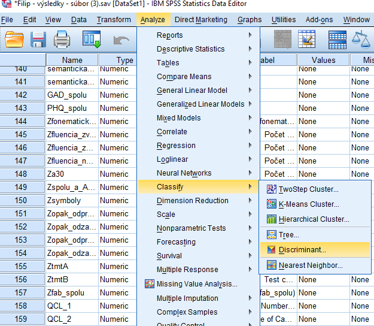

Ako Grouping Variable označíme vybranú typológiu a definujeme jej rozsah. Do políčka Independents zahrnieme všetky Zetkové premenné.

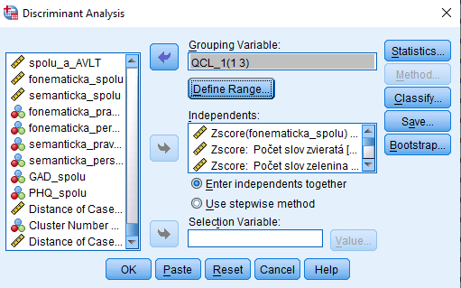

Klikneme na Classify a zaklikneme možnosť Summary table

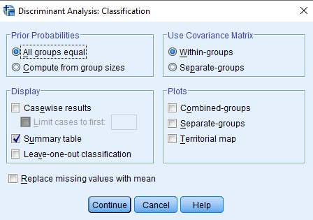

Vo výstupoch nás zaujíma posledná tabuľka:

V prípade prvej typológie bolo zaradených správne 100% participantov.

<table style="width:72%;">
<colgroup>
<col style="width: 8%" />
<col style="width: 6%" />
<col style="width: 22%" />
<col style="width: 9%" />
<col style="width: 9%" />
<col style="width: 9%" />
<col style="width: 6%" />
</colgroup>
<tbody>
<tr>
<td colspan="7" style="text-align: center;"><blockquote>

<strong>Classification Resultsa</strong>

</blockquote></td>
</tr>
<tr>
<td style="text-align: center;"></td>
<td style="text-align: center;"></td>
<td rowspan="2" style="text-align: center;"><blockquote>

Cluster Number of Case

</blockquote></td>
<td colspan="3" style="text-align: center;"><blockquote>

Predicted Group Membership

</blockquote></td>
<td rowspan="2" style="text-align: center;"><blockquote>

Total

</blockquote></td>
</tr>
<tr>
<td style="text-align: center;"></td>
<td style="text-align: center;"></td>
<td style="text-align: center;"><blockquote>

1

</blockquote></td>
<td style="text-align: center;"><blockquote>

2

</blockquote></td>
<td style="text-align: center;"><blockquote>

3

</blockquote></td>
</tr>
<tr>
<td rowspan="6" style="text-align: center;"><blockquote>

Original

</blockquote></td>
<td rowspan="3" style="text-align: center;"><blockquote>

Count

</blockquote></td>
<td style="text-align: center;"><blockquote>

1

</blockquote></td>
<td style="text-align: right;"><blockquote>

15

</blockquote></td>
<td style="text-align: right;"><blockquote>

0

</blockquote></td>
<td style="text-align: right;"><blockquote>

0

</blockquote></td>
<td style="text-align: right;"><blockquote>

15

</blockquote></td>
</tr>
<tr>
<td style="text-align: center;"><blockquote>

2

</blockquote></td>
<td style="text-align: right;"><blockquote>

0

</blockquote></td>
<td style="text-align: right;"><blockquote>

10

</blockquote></td>
<td style="text-align: right;"><blockquote>

0

</blockquote></td>
<td style="text-align: right;"><blockquote>

10

</blockquote></td>
</tr>
<tr>
<td style="text-align: center;"><blockquote>

3

</blockquote></td>
<td style="text-align: right;"><blockquote>

0

</blockquote></td>
<td style="text-align: right;"><blockquote>

0

</blockquote></td>
<td style="text-align: right;"><blockquote>

28

</blockquote></td>
<td style="text-align: right;"><blockquote>

28

</blockquote></td>
</tr>
<tr>
<td rowspan="3" style="text-align: center;"><blockquote>

%

</blockquote></td>
<td style="text-align: center;"><blockquote>

1

</blockquote></td>
<td style="text-align: right;"><blockquote>

100,0

</blockquote></td>
<td style="text-align: right;"><blockquote>

,0

</blockquote></td>
<td style="text-align: right;"><blockquote>

,0

</blockquote></td>
<td style="text-align: right;"><blockquote>

100,0

</blockquote></td>
</tr>
<tr>
<td style="text-align: center;"><blockquote>

2

</blockquote></td>
<td style="text-align: right;"><blockquote>

,0

</blockquote></td>
<td style="text-align: right;"><blockquote>

100,0

</blockquote></td>
<td style="text-align: right;"><blockquote>

,0

</blockquote></td>
<td style="text-align: right;"><blockquote>

100,0

</blockquote></td>
</tr>
<tr>
<td style="text-align: center;"><blockquote>

3

</blockquote></td>
<td style="text-align: right;"><blockquote>

,0

</blockquote></td>
<td style="text-align: right;"><blockquote>

,0

</blockquote></td>
<td style="text-align: right;"><blockquote>

100,0

</blockquote></td>
<td style="text-align: right;"><blockquote>

100,0

</blockquote></td>
</tr>
<tr>
<td colspan="7" style="text-align: center;"><blockquote>

a. 100,0% of original grouped cases correctly classified.

</blockquote></td>
</tr>
</tbody>
</table>

V druhej typológii (štvortypovej) je to 98,1% participantov – jedného participanta diskriminačná analýza „preradila“ z druhého typu do prvého.

<table style="width:72%;">
<colgroup>
<col style="width: 8%" />
<col style="width: 6%" />
<col style="width: 22%" />
<col style="width: 7%" />
<col style="width: 5%" />
<col style="width: 7%" />
<col style="width: 7%" />
<col style="width: 6%" />
</colgroup>
<tbody>
<tr>
<td colspan="8" style="text-align: center;"><blockquote>

<strong>Classification Resultsa</strong>

</blockquote></td>
</tr>
<tr>
<td style="text-align: center;"></td>
<td style="text-align: center;"></td>
<td rowspan="2" style="text-align: center;"><blockquote>

Cluster Number of Case

</blockquote></td>
<td colspan="4" style="text-align: center;"><blockquote>

Predicted Group Membership

</blockquote></td>
<td rowspan="2" style="text-align: center;"><blockquote>

Total

</blockquote></td>
</tr>
<tr>
<td style="text-align: center;"></td>
<td style="text-align: center;"></td>
<td style="text-align: center;"><blockquote>

1

</blockquote></td>
<td style="text-align: center;"><blockquote>

2

</blockquote></td>
<td style="text-align: center;"><blockquote>

3

</blockquote></td>
<td style="text-align: center;"><blockquote>

4

</blockquote></td>
</tr>
<tr>
<td rowspan="8" style="text-align: center;"><blockquote>

Original

</blockquote></td>
<td rowspan="4" style="text-align: center;"><blockquote>

Count

</blockquote></td>
<td style="text-align: center;"><blockquote>

1

</blockquote></td>
<td style="text-align: right;"><blockquote>

14

</blockquote></td>
<td style="text-align: right;"><blockquote>

0

</blockquote></td>
<td style="text-align: right;"><blockquote>

0

</blockquote></td>
<td style="text-align: right;"><blockquote>

0

</blockquote></td>
<td style="text-align: right;"><blockquote>

14

</blockquote></td>
</tr>
<tr>
<td style="text-align: center;"><blockquote>

2

</blockquote></td>
<td style="text-align: right;"><blockquote>

1

</blockquote></td>
<td style="text-align: right;"><blockquote>

21

</blockquote></td>
<td style="text-align: right;"><blockquote>

0

</blockquote></td>
<td style="text-align: right;"><blockquote>

0

</blockquote></td>
<td style="text-align: right;"><blockquote>

22

</blockquote></td>
</tr>
<tr>
<td style="text-align: center;"><blockquote>

3

</blockquote></td>
<td style="text-align: right;"><blockquote>

0

</blockquote></td>
<td style="text-align: right;"><blockquote>

0

</blockquote></td>
<td style="text-align: right;"><blockquote>

12

</blockquote></td>
<td style="text-align: right;"><blockquote>

0

</blockquote></td>
<td style="text-align: right;"><blockquote>

12

</blockquote></td>
</tr>
<tr>
<td style="text-align: center;"><blockquote>

4

</blockquote></td>
<td style="text-align: right;"><blockquote>

0

</blockquote></td>
<td style="text-align: right;"><blockquote>

0

</blockquote></td>
<td style="text-align: right;"><blockquote>

0

</blockquote></td>
<td style="text-align: right;"><blockquote>

5

</blockquote></td>
<td style="text-align: right;"><blockquote>

5

</blockquote></td>
</tr>
<tr>
<td rowspan="4" style="text-align: center;"><blockquote>

%

</blockquote></td>
<td style="text-align: center;"><blockquote>

1

</blockquote></td>
<td style="text-align: right;"><blockquote>

100,0

</blockquote></td>
<td style="text-align: right;"><blockquote>

,0

</blockquote></td>
<td style="text-align: right;"><blockquote>

,0

</blockquote></td>
<td style="text-align: right;"><blockquote>

,0

</blockquote></td>
<td style="text-align: right;"><blockquote>

100,0

</blockquote></td>
</tr>
<tr>
<td style="text-align: center;"><blockquote>

2

</blockquote></td>
<td style="text-align: right;"><blockquote>

4,5

</blockquote></td>
<td style="text-align: right;"><blockquote>

95,5

</blockquote></td>
<td style="text-align: right;"><blockquote>

,0

</blockquote></td>
<td style="text-align: right;"><blockquote>

,0

</blockquote></td>
<td style="text-align: right;"><blockquote>

100,0

</blockquote></td>
</tr>
<tr>
<td style="text-align: center;"><blockquote>

3

</blockquote></td>
<td style="text-align: right;"><blockquote>

,0

</blockquote></td>
<td style="text-align: right;"><blockquote>

,0

</blockquote></td>
<td style="text-align: right;"><blockquote>

100,0

</blockquote></td>
<td style="text-align: right;"><blockquote>

,0

</blockquote></td>
<td style="text-align: right;"><blockquote>

100,0

</blockquote></td>
</tr>
<tr>
<td style="text-align: center;"><blockquote>

4

</blockquote></td>
<td style="text-align: right;"><blockquote>

,0

</blockquote></td>
<td style="text-align: right;"><blockquote>

,0

</blockquote></td>
<td style="text-align: right;"><blockquote>

,0

</blockquote></td>
<td style="text-align: right;"><blockquote>

100,0

</blockquote></td>
<td style="text-align: right;"><blockquote>

100,0

</blockquote></td>
</tr>
<tr>
<td colspan="8" style="text-align: center;"><blockquote>

a. 98,1% of original grouped cases correctly classified.

</blockquote></td>
</tr>
</tbody>
</table>

.
